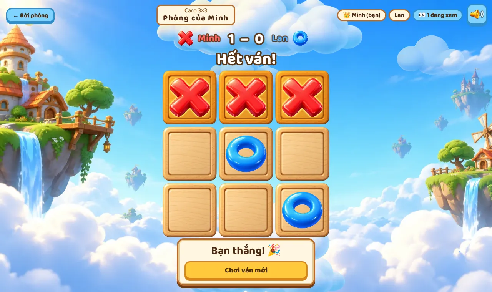

# Chơi Chút Bài (Play Some Cards)

Board and card games to play with friends in the browser, on floating sky islands. Pick a game,
open a room, and your friends join from the room list, as players or to watch.

**Play:** https://play-some-cards.vercel.app



## Run it locally (5 minutes)

You need Node 22 and [Git LFS](https://git-lfs.com) (for the source art in `assets/`).

```
git lfs install
git clone https://github.com/MinhWorker/play-some-cards.git
cd play-some-cards
npm install
npm run dev        # open http://localhost:5033
```

No accounts or secrets needed: without a database the server keeps accounts in memory. Open a
second browser window (or a private one) to play against yourself.

## What's inside

- `games/<id>`: one folder per game (rules, board, art, sounds). Make your own with
  `npm run new:game`, see [docs/making-a-game.md](docs/making-a-game.md)
- `packages/sdk`: the small API games are written against
- `apps/web`: React + Vite for the UI, Phaser 4 for the world and the game boards
- `apps/server`: NestJS + Socket.IO; the server owns the rooms and checks every move

`npm run check` runs lint, type checks and tests. More commands and the full map: `AGENTS.md`.

## Contributing

Anyone is welcome, with whatever tools you like. See [CONTRIBUTING.md](CONTRIBUTING.md).
Deploying: [docs/deploy.md](docs/deploy.md).

## License

Code: [MIT](LICENSE). Art and audio: [CC BY-NC 4.0](LICENSE-ASSETS.md) (free to use and change,
not for making money), with a few listed exceptions.
