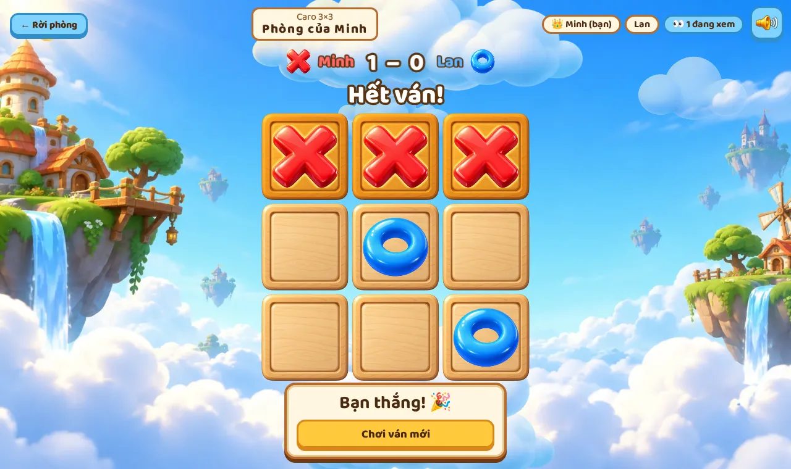

# Chơi chút bài (Play Some Cards)

Game bàn cờ và bài để chơi với bạn bè ngay trên trình duyệt, giữa những hòn đảo bay trên trời.
Chọn một game, mở phòng, bạn bè vào từ danh sách phòng để chơi hoặc xem.

**Chơi:** https://play-some-cards.vercel.app

Có thể cài Chơi chút bài từ nút cài đặt trên Chrome khi trình duyệt hỗ trợ. Khi mất kết nối,
trang báo ngoại tuyến sẽ thay cho màn hình lỗi.



## Chạy trên máy (5 phút)

Cần Node 22 và [Git LFS](https://git-lfs.com) (cho ảnh gốc trong `assets/`).

```
git lfs install
git clone https://github.com/MinhWorker/play-some-cards.git
cd play-some-cards
npm install
npm run dev        # mở http://localhost:5033
```

Không cần tài khoản hay khoá bí mật nào: không có database thì server giữ tài khoản trong bộ nhớ.
Mở thêm một cửa sổ trình duyệt (hoặc cửa sổ ẩn danh) để tự chơi với chính mình.

## Bên trong có gì

- `games/<id>`: mỗi game một thư mục (luật, màn chơi, hình, âm thanh). Tự làm game với
  `npm run new:game` (và từng file với `npm run new`), xem [docs/making-a-game.md](docs/making-a-game.md)
- `packages/sdk`: bộ API nhỏ mà các game dùng
- `apps/web`: React + Vite cho giao diện, Phaser 4 cho thế giới và bàn chơi. Định hướng giao diện
  (khung ngang, HUD, bàn chơi): [docs/ui-guide.md](docs/ui-guide.md)
- `apps/server`: NestJS + Socket.IO; server giữ các phòng và kiểm tra mọi nước đi

`npm run check` chạy lint, kiểm tra kiểu và test. Các lệnh khác và bản đồ đầy đủ: `AGENTS.md`.

## Đóng góp

Ai cũng được chào đón, dùng công cụ nào cũng được. Xem [CONTRIBUTING.md](CONTRIBUTING.md).
Triển khai: [docs/deploy.md](docs/deploy.md).

## Giấy phép

Mã nguồn: [MIT](LICENSE). Hình và âm thanh: [CC BY-NC 4.0](LICENSE-ASSETS.md) (tự do dùng và
sửa, không dùng để kiếm tiền), trừ vài ngoại lệ được liệt kê.
