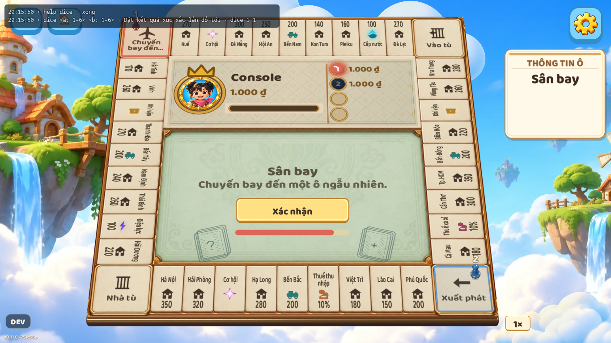
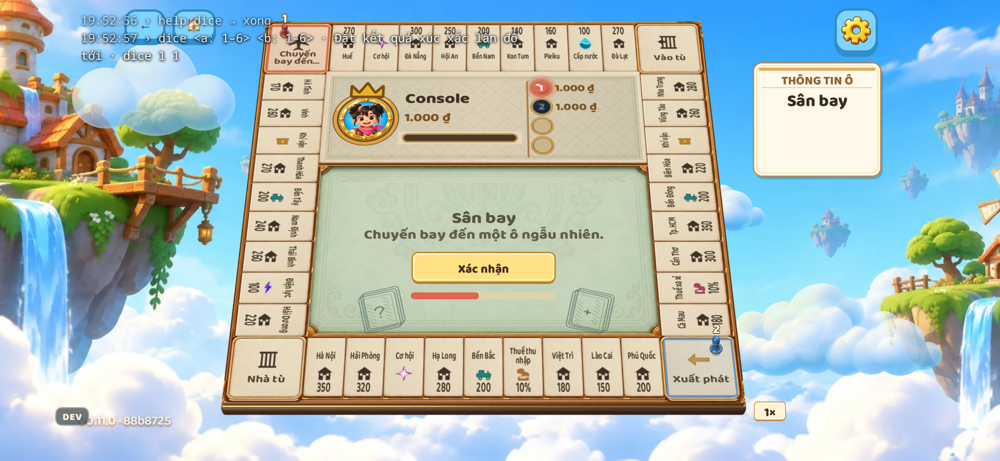
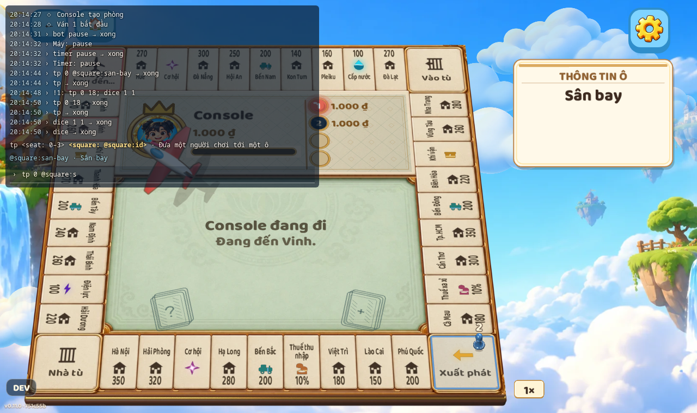

# Thiết kế Dev Console (bảng lệnh dev)

Trạng thái: đã triển khai. Kế hoạch gốc đối chiếu `v0.10.0`; triển khai trên `main` sau lần cân
bằng Cờ tỷ phú Classic (PR #63). Bảy bước dưới đây được giữ lại làm bản đồ review.

Dev Console cho phép gõ lệnh để đổi trạng thái một phòng đang chơi, giống chế độ cheat của
Minecraft hay `sv_cheats` của Source engine. Ví dụ: đặt xúc xắc lần tới, đưa người chơi tới một
ô, lưu và khôi phục ván, chơi thay người khác. Mục đích là test nhanh trong lúc phát triển, kể
cả trong e2e, mà không phải chơi lại cả ván để tới đúng tình huống.

Tên gọi: dùng "Dev Console", không dùng "Cheat Engine" vì đó là tên một phần mềm hack bộ nhớ
có sẵn và rất phổ biến, dễ gây nhầm. Trong code: `dev console`, sự kiện socket `dev:*`.

## 1. Nguyên tắc

1. **Chạy trên server thật.** Không giả lập server, không nhân đôi logic. Lệnh đi qua socket
   như một nước đi, server thực thi, rồi gửi state mới cho cả phòng như bình thường.
2. **Server tự khoá.** Chỉ khi server khởi động với `PSC_DEV=1` thì mới nhận lệnh. Việc kiểm
   tra nằm ở server, không dựa vào việc web có hiện bảng hay không. Production (Render) không
   bao giờ đặt biến này.
3. **Game mới tự có lệnh.** Giống `/give` của Minecraft nhận item của mod: lệnh của engine
   làm việc trên các *khái niệm engine biết* (state, sự kiện, ghế, bộ đếm giờ, số ngẫu nhiên),
   còn game chỉ *đăng ký nội dung* vào đó. Thêm một game không phải sửa gì ở console.
4. **Game không bắt buộc làm gì.** Tầng 1 và 2 dùng được cho mọi game hiện có. Tầng 3 và 4
   là tuỳ chọn; SDK chỉ ép kiểu khi game có khai báo.

## 2. Bốn tầng lệnh

| Tầng | Nguồn | Game phải viết gì | Ví dụ |
| --- | --- | --- | --- |
| 1. Lệnh engine | Server | Không gì | `state set players.1.position 20`, `snapshot save x`, `undo`, `seed 42`, `timer fire` |
| 2. Sự kiện game | `events` (zod) có sẵn của game | Không gì | `as 1 roll`, `as 0 bid amount=120` |
| 3. Danh mục (catalog) | `catalogs` của game | Danh sách dữ liệu | `state set players.1.position @square:san-bay` |
| 4. Lệnh riêng | `commands` + hook `cmd<Name>` của game | Hàm thuần như hook | `dice 1 1`, `tp 1 @square:san-bay` |

Cây lệnh được ghép lúc chạy từ bốn nguồn trên. Server gửi cây này xuống web (kèm JSON Schema
của tham số, dùng `z.toJSONSchema` của zod 4) để ô nhập lệnh gợi ý bằng Tab.

### 2.1 Cú pháp

```
<lệnh> [đối số theo vị trí...] [khoá=giá trị...]
```

- Giá trị: số, `true`/`false`/`null`, chuỗi trong `"..."`, JSON (`{...}`, `[...]`), hoặc một
  từ trơn (hiểu là chuỗi).
- `@<danh-mục>:<id>` là tham chiếu danh mục, được đổi thành `value` của mục đó. Ví dụ
  `@square:san-bay` → `20`.
- Ghế: số thứ tự ghế (`0`, `1`, …). Không dùng id tài khoản.
- Lệnh của game được đặt tên không trùng lệnh engine (kiểm tra bằng test, xem mục 4.3).
- Nhiều lệnh trên một dòng, cách nhau bằng `;`, chạy lần lượt và dừng ở lệnh lỗi đầu tiên.
  Ví dụ `tp 0 @square:san-bay; dice 1 1`. Ghim lệnh (mục 5.5) dùng cách này.

### 2.2 Lệnh engine (tầng 1 và 2)

| Lệnh | Tác dụng |
| --- | --- |
| `help [lệnh]` | Liệt kê lệnh, hoặc chi tiết một lệnh |
| `state get [đường-dẫn]` | In một phần state đầy đủ (kể cả phần bị ẩn với người chơi) |
| `state set <đường-dẫn> <giá-trị>` | Sửa một trường của state game |
| `state dump` | In toàn bộ `Stored` (state, ghế, timer, kết quả) |
| `snapshot save <tên>` / `load <tên>` / `list` / `delete <tên>` | Lưu và khôi phục ván ra file |
| `undo [n]` | Quay lại n thay đổi (nước đi, timer, lệnh dev); mặc định 1 |
| `seed <n>` / `seed off` | Bộ số ngẫu nhiên của phòng lặp lại được |
| `rng push <số...>` / `rng clear` | Các lần gọi `rng()` tiếp theo trả về đúng các số này |
| `timer info` / `fire` / `pause` / `resume` | Điều khiển bộ đếm giờ của game |
| `bot pause` / `resume` / `step` | Dừng bot tự đi, cho bot đi một nước |
| `finish [ghế...]` | Kết thúc ván với những người thắng này (`finish` trống = hoà) |
| `restart` | Bắt đầu ván mới như `game:restart`, bỏ qua quyền chủ phòng |
| `events` | Liệt kê sự kiện của game và tham số |
| `as <ghế> <sự-kiện> [tham số]` | Gửi một sự kiện thay cho ghế đó, qua đúng đường kiểm tra luật |

`state set` không kiểm tra state có hợp lệ không (giống `/data` của Minecraft). Dùng `undo`
nếu làm hỏng. Một schema state tuỳ chọn có thể thêm sau (mục 7).

## 3. Thiết kế phía server

### 3.1 Bật chế độ dev

- `apps/server`: đọc `process.env.PSC_DEV === '1'` một lần khi khởi động, ví dụ trong một
  provider `DEV_MODE`. Ghi một dòng log khi bật.
- Script `dev` của `apps/server` đặt `PSC_DEV=1`. Cách đặt phải chạy được trên mọi hệ điều
  hành (kiểm tra xem repo đã có `cross-env` chưa, hoặc dùng cách tương đương).
- `render.yaml` không đặt biến này. Thêm một dòng chú thích nói rõ là không được đặt.

### 3.2 Giao thức (`packages/shared/src/protocol.ts`)

Thêm vào `ClientToServerEvents`:

```ts
/** Dev only (server started with PSC_DEV=1): run a console line in your current room. */
'dev:command': (req: { line: string }, ack: Ack<{ output: string }>) => void;
/** Dev only: the command tree for the console's suggestions. */
'dev:schema': (req: Record<string, never>, ack: Ack<DevConsoleSchema>) => void;
```

Thêm cho log phòng (mục 3.4):

```ts
// ClientToServerEvents
/**
 * Dev only: start (`on: true`) or stop following the room log. Starting returns the log so
 * far; the server then sends 'dev:log' to this socket until it stops or leaves the room.
 */
'dev:logs': (req: { on: boolean }, ack: Ack<{ entries: DevLogEntry[] }>) => void;

// ServerToClientEvents
/** Dev only: one new line of the room log, sent to the sockets following it. */
'dev:log': (entry: DevLogEntry) => void;
```

`DevConsoleSchema` còn có nhãn danh mục, đường dẫn state và tên snapshot để gợi ý. `Ack` lỗi
có thể kèm `issue: { message, at, end?, suggestion? }` để tô đoạn sai.

- Khi server không bật dev, các lệnh trả `{ ok: false, error: 'Server không bật chế độ dev' }`,
  và server không bao giờ gửi `dev:log`.
- Chỉ thêm sự kiện nên không phá client cũ: không tăng `PROTOCOL_VERSION`, gắn nhãn
  `protocol:compatible` cho PR.
- Người gửi phải đang ở trong phòng (người chơi hoặc khán giả). Không cần là chủ phòng.

### 3.3 Module `apps/server/src/dev/`

- `dev-console.service.ts`: phân tích dòng lệnh, chọn lệnh, gọi vào `RoomsService` hoặc
  `GameRules`. Có unit test.
- Gateway có các handler `dev:command`, `dev:schema`, `dev:logs`. Sau một lệnh làm đổi phòng, gọi
  đúng các bước như sau một nước đi: `settle`, đồng bộ timer, lên lịch bot, `broadcast`.
- `RoomsService` cần thêm (chỉ có tác dụng khi dev bật):
  - **RNG theo phòng.** Thay hằng `rng` dùng chung (dòng `const rng = () => Math.random()`)
    bằng `rngOf(room)`: trước hết lấy từ hàng đợi `rng push`, sau đó từ `seededRng(seed)` nếu
    có `seed`, cuối cùng `Math.random`. Khi dev tắt, hành vi giữ y như cũ.
  - **Lịch sử để undo.** Trước mỗi thay đổi (nước đi, timer, rời phòng, lệnh dev), đẩy một bản
    sao state, `last`, trạng thái/kết quả, tỉ số, vòng, timer, giờ bắt đầu/kết thúc, RNG và cờ
    tạm dừng vào bộ đệm vòng 50 phần tử của phòng.
  - **Snapshot ra file.** `.dev/snapshots/<gameId>/<tên>.json` ở gốc repo (thêm `.dev/` vào
    `.gitignore`). Khi nạp: phải cùng `gameId` và cùng số ghế; đổi id người chơi trong `Stored`
    theo thứ tự ghế sang id của phòng hiện tại. Snapshot còn lại sau khi server khởi động lại.
  - **Tạm dừng timer và bot.** Cờ `room.dev.timerPaused`, `room.dev.botsPaused`. Gateway giữ
    `setTimeout`, nên tạm dừng = huỷ handle và nhớ thời gian còn lại; tiếp tục = lên lịch lại.
- `as <ghế> <sự-kiện>` gọi đúng `RoomsService.move` với id của ghế đó, nên vẫn qua
  `validateMove` và đặt `room.last`, màn hình có hoạt ảnh như thật.
- `state set` và các lệnh không phải nước đi: không đổi `room.last`. Màn hình nhận state mới
  qua `onState` (giống khi resync). Undo làm `last.seq` quay lùi và nạp snapshot của vòng khác đều dựng lại
  màn hình bằng `onResync`, không replay sự kiện cũ.

### 3.4 Log phòng

Server hiện gần như không ghi log (chỉ vài `console.error` trong `rooms.gateway.ts`). Phần này
tạo ra một nhật ký **theo từng phòng**, chỉ khi bật `PSC_DEV`. Không gửi log của cả tiến trình
server: nó lẫn các phòng và tài khoản khác.

```ts
export interface DevLogEntry {
  id: number;            // tăng dần trong phòng, để client bỏ dòng trùng
  t: number;             // Date.now()
  level: 'info' | 'warn' | 'error';
  kind: 'move' | 'reject' | 'timer' | 'bot' | 'command' | 'game' | 'room' | 'error';
  seat?: number;
  text: string;          // một câu tiếng Việt dễ đọc
  data?: unknown;        // chi tiết để mở ra xem (tham số, state, stack)
}
```

| `kind` | Khi nào | Ví dụ `text` |
| --- | --- | --- |
| `move` | Một nước đi được chấp nhận | `Người 2 (ghế 1) gửi roll · 3 ms` |
| `reject` | Nước đi bị từ chối | `Người 1 gửi buy → bị từ chối: Chưa tới lượt bạn` |
| `timer` | Timer được đặt hoặc chạy | `Timer turn-over: 30 giây` / `Timer turn-over đã chạy` |
| `bot` | Bot chọn nước | `Bot (ghế 2) chọn roll` |
| `command` | Một lệnh dev | `dice 1 1 → xong` |
| `game` | `console.*` trong hook của game | `landed 20` |
| `room` | Vào, rời phòng, bắt đầu ván, kết thúc ván | `Ván 3 bắt đầu` |
| `error` | Lỗi trong hook, timer hoặc bot | `Lỗi trong onRoll: Cannot read …` (stack ở `data`) |

- Mỗi phòng giữ một bộ đệm vòng 500 dòng (`room.dev.log`). Mỗi dòng mới vừa vào bộ đệm vừa
  được gửi `dev:log` cho các socket đang theo dõi (đã gửi `dev:logs` với `on: true`). Socket
  rời phòng thì tự thôi theo dõi.
- **Bắt `console` của game.** Hook của game chạy đồng bộ, nên khi bật dev, `RoomsService` bọc
  mỗi lần gọi vào `GameRules` (`setup`, `applyMove`, `fireTimer`, `leave`, `bot`, lệnh riêng)
  bằng một hàm `captureConsole(room, fn)`: tạm thay `console.log/info/warn/error`, ghi mỗi lần
  gọi thành một dòng `game` của phòng, vẫn in ra terminal như cũ, rồi trả lại `console` gốc
  trong `finally`. Game không cần dùng API mới.
- `data` lớn (ví dụ cả state) bị cắt ở khoảng 20 KB khi gửi, kèm ghi chú "đã cắt".
- Đặt code ở `apps/server/src/dev/room-log.ts`, có unit test.

## 4. Thay đổi SDK

Câu hỏi "có cần ép game tuân thủ API không": **có, nhưng chỉ khi game khai báo**. Không game
nào bắt buộc phải viết lệnh. Khi đã khai báo thì SDK ép bằng kiểu TypeScript, bằng test chung
của registry và bằng cùng quy ước với `events`.

### 4.1 Lệnh riêng: `commands` + `cmd<Name>`

Theo đúng mẫu `events` + `on<Name>` đã có, để tác giả game không phải học thêm cách mới:

```ts
class CoTyPhuClassicGame extends Game<State, Options, View> {
  events = { roll: z.object({}), /* ... */ };

  override readonly commands = {
    dice: z.object({ a: z.int().min(1).max(6), b: z.int().min(1).max(6) })
      .describe('Đặt kết quả xúc xắc lần đổ tới'),
    tp: z.object({ seat: z.int(), square: catalog('square') })
      .describe('Đưa một người chơi tới một ô'),
  };

  cmdDice(ctx: CommandContext<State, Options, { a: number; b: number }>): State { ... }
  cmdTp(ctx: CommandContext<State, Options, { seat: number; square: number }>): State { ... }
}
```

- `CommandContext` giống `GameContext` (có `state`, `players`, `rng`, `setTimer`, `finish`…)
  cộng thêm `args` và `reject(message)`. Hook là hàm thuần: trả về state mới.
- Đối số theo vị trí điền theo thứ tự khoá của `z.object`.
- `gameRules` thêm vào `GameRules`:
  - `commands?: Record<string, z.ZodObject>`;
  - `runCommand?(stored, name, args, rng, room): Stored<State>`, dùng chung `runHook`.
- Thiếu hook `cmd<Name>` cho một lệnh đã khai báo thì báo lỗi ngay khi tạo `gameRules`
  (giống cách `setTimer` báo thiếu hook).

### 4.2 Danh mục: `catalogs` + `catalog()`

```ts
override readonly catalogs = {
  square: BOARD.map((s, i) => ({ id: s.slug, value: i, label: s.name })),
  card: CARDS.map((c) => ({ id: c.slug, value: c.id, label: c.title })),
};
```

- `id`: kebab-case, duy nhất trong danh mục. `label`: tiếng Việt, để hiện trong gợi ý.
- `catalog('square')` (export từ `@psc/sdk`) mặc định là schema số có `.meta({ catalog: 'square' })`;
  truyền schema thứ hai để dùng value chuỗi hoặc object.
  Bộ phân tích lệnh đổi `@square:<id>` thành `value`; JSON Schema gửi xuống web giữ `meta`
  để ô nhập gợi ý được danh sách id.
- Dùng được ở mọi nơi nhận giá trị: tham số lệnh riêng, `as`, và `state set`.

### 4.3 Kiểm tra chung (`packages/shared/src/registry.test.ts`)

Với mọi game có khai báo:

- tên lệnh không trùng lệnh engine (danh sách export từ SDK);
- mỗi lệnh là `z.object` và có hook `cmd<Name>`;
- `id` trong danh mục đúng kebab-case và không trùng;
- `catalog('x')` chỉ trỏ tới danh mục có thật.

### 4.4 Test đơn vị cho game

`packages/sdk/src/testing.ts` thêm vào `testGame(...)`:

```ts
game.command('dice 1 1');          // chạy một dòng lệnh, dùng chung bộ phân tích với server
game.command('tp 1 @square:san-bay');
```

Bộ phân tích dòng lệnh đặt ở `packages/sdk/src/console/` (thuần, không phụ thuộc Node), để
server, `testing.ts` và web cùng dùng.

## 5. Giao diện Dev Console trên web

Dev Console là một **lớp phủ có nền tối bán trong suốt, chỉ dùng bàn phím**, giống khung chat và console của
Minecraft hay Quake. Ba quy tắc không được phá:

1. **Không nhận chuột hay chạm.** Toàn bộ lớp phủ, kể cả ô gõ lệnh, có `pointer-events: none`.
   Mọi cú bấm đi thẳng xuống game như thể lớp phủ không có ở đó.
2. **Không giữ bàn phím khi chưa được gọi.** Ngoài các tổ hợp phím của nó (mục 5.2), lớp phủ
   không nghe phím nào cho tới khi ô lệnh được focus.
3. **Không làm xê dịch giao diện game.** Lớp phủ là `position: fixed`, không đổi kích
   thước khung game (`lib/frame.ts`), nền tối bán trong suốt, chữ mờ dần; ẩn/hiện bằng một phím.

Người mới vẫn dùng được nhờ: bảng phím tắt hiện bằng `?`, gợi ý hiện ngay khi gõ, và lỗi có
gợi ý sửa. Mọi lệnh đều đi qua cùng một hàm `runCommand(line)`.

### 5.1 Ba trạng thái

| Trạng thái | Thấy gì | Bàn phím | Chuột |
| --- | --- | --- | --- |
| **Tắt** | Không có gì | Chỉ nghe tổ hợp phím của 5.2 | Đi xuống game |
| **Xem** (mặc định khi hiện) | Log mới nhất, mờ dần sau 10 giây | Chỉ nghe tổ hợp phím của 5.2 | Đi xuống game |
| **Gõ lệnh** | Log 20 dòng gần nhất rõ nét, ô lệnh, gợi ý | Ô lệnh nhận hết phím | Đi xuống game; bấm vào game thì thoát về **Xem** |

- Công tắc **"Dev Console"** trong bảng DEV (`DEV_SETTINGS`) là công tắc tổng: tắt thì không
  có lớp phủ, không nghe phím, và client gửi `dev:logs { on: false }` để server thôi gửi log.
  Bật thì client gửi `dev:logs { on: true }` (gửi lại sau mỗi lần vào phòng hoặc kết nối lại).

  ```ts
  console: { label: 'Dev Console', type: 'toggle', default: false },
  ```

- Đang ở trạng thái **Tắt** (ẩn nhanh bằng phím) thì log vẫn được nhận và giữ lại, để hiện lại
  là thấy ngay.
- Cả bảng DEV lẫn lớp phủ chỉ có khi `devToolsEnabled`. Mã lớp phủ tải lười (`React.lazy`)
  khi công tắc tổng bật.

### 5.2 Tổ hợp phím

Đặt hết trong một hằng `DEV_CONSOLE_KEYS` để dễ đổi. So khớp bằng `event.code` (vị trí phím),
không bằng `event.key`, để chạy đúng với mọi kiểu bàn phím và khi đang bật bộ gõ tiếng Việt.
Dùng `Ctrl` trên cả macOS (vì `` Cmd+` `` là phím chuyển cửa sổ của macOS).

| Phím | Ở đâu | Tác dụng |
| --- | --- | --- |
| `Ctrl` + `` ` `` | Mọi lúc | Hiện / ẩn lớp phủ (Xem ↔ Tắt) |
| `Ctrl` + `/` | Mọi lúc | Focus ô lệnh (tự hiện lớp phủ nếu đang ẩn) |
| `Esc` | Trong ô lệnh | Đóng gợi ý; bấm lần nữa thì thoát về **Xem** |
| `Enter` | Trong ô lệnh | Chạy lệnh; ô lệnh vẫn focus để gõ tiếp |
| `↑` / `↓` | Trong ô lệnh | Lịch sử lệnh (100 dòng, lưu `localStorage`) |
| `Tab` / `Shift+Tab` | Trong ô lệnh | Chọn gợi ý kế tiếp / trước đó |
| `PageUp` / `PageDown` | Trong ô lệnh | Cuộn log |
| `?` khi ô lệnh trống | Trong ô lệnh | Hiện / ẩn bảng phím tắt |

- Tổ hợp phím "mọi lúc" vẫn bị bỏ qua khi con trỏ đang ở một ô nhập khác của app (ví dụ form
  đăng nhập), và khi `event.isComposing` (bộ gõ đang ghép chữ).
- Khi một tổ hợp phím của lớp phủ khớp, gọi `preventDefault()` để trình duyệt không làm gì khác.
- **Ô lệnh không để phím lọt xuống game:** trong `keydown`/`keyup` của ô lệnh gọi
  `stopPropagation()`; thêm nữa, khi ô lệnh focus thì tắt bàn phím của Phaser
  (`game.input.keyboard.enabled = false`) và bật lại khi thoát. Hiện chưa game nào dùng bàn phím,
  nhưng phải sẵn sàng cho game sau này.
- Ô lệnh bị `pointer-events: none` nhưng vẫn focus được bằng `input.focus()` từ code.

### 5.3 Bố cục và hiển thị

```
┌──────────────────────────────── màn hình game ─────────────────────────────────┐
│ 12:03:41 ▸ Người 2 gửi roll · 3 ms                                              │
│ 12:03:41 ✗ Người 1 gửi buy → bị từ chối: Chưa tới lượt bạn                      │
│ 12:03:42 ⏱ Timer turn-over: 30 giây                                             │
│                       (game vẫn bấm được ở mọi chỗ, kể cả dưới chữ)             │
│                                                                                 │
│  dice <a: 1–6> <b: 1–6> · Đặt kết quả xúc xắc lần đổ tới                        │
│  › dice 1 _                          [gợi ý: 1  2  3  4  5  6]                   │
└─────────────────────────────────────────────────────────────────────────────────┘
```

- **Vị trí:** dính góc trên bên trái, rộng tối đa 45% màn hình, chừa tai thỏ bằng
  `env(safe-area-inset-*)`. Đổi sang góc khác bằng lệnh `.dock` (mục 5.5). Ô lệnh nằm ở mép dưới
  của khung log.
- **Nền tối bán trong suốt:** nền phủ toàn bộ khung log, ô lệnh và gợi ý để chữ rõ trên cảnh
  sáng; chữ trắng có viền bóng (`text-shadow`). Độ đậm của cả lớp phủ chỉnh bằng `.opacity`.
- **Mờ dần:** ở trạng thái **Xem**, mỗi dòng hiện tối đa 10 giây rồi mờ đi, tối đa 8 dòng. Dòng
  lỗi giữ lâu hơn (30 giây). Khi hết log, nền cũng ẩn. Ở trạng thái **Gõ lệnh**, hiện 20 dòng gần nhất, không mờ.
- **Thứ tự lớp:** trên canvas và HUD của game, dưới các hộp thoại của app (ví dụ hộp hồ sơ),
  để không che chữ của hộp thoại. `z-index: 2` nằm dưới modal (`3`); bảng DEV hiện có dùng tầng riêng (`101`).
- **Không chọn chữ được** (vì không nhận chuột): sao chép bằng `.copy`.
- Mỗi dòng log cũng được in ra DevTools của trình duyệt bằng `console.groupCollapsed`, kèm
  `data` là object thật. Muốn xem chi tiết (state, tham số, stack) thì mở DevTools của trình
  duyệt và bấm vào đó. Lớp phủ chỉ hiện tóm tắt một dòng; lỗi hiện thêm dòng đầu của stack.

### 5.4 Gõ lệnh cho người mới

Không có form hay nút; thay vào đó ô lệnh **dẫn từng bước**:

- Gõ tới đâu, một dòng phía trên ô lệnh hiện **cách dùng** của lệnh đang gõ, ví dụ
  `dice <a: 1–6> <b: 1–6> · Đặt kết quả xúc xắc lần đổ tới`, và tô đậm tham số đang nhập.
- Bên phải hiện **gợi ý** cho đúng chỗ đang gõ: tên lệnh, tên sự kiện, ghế (kèm tên người chơi),
  giá trị `enum`, id danh mục kèm `label` tiếng Việt, đường dẫn state. `Tab` chọn lần lượt.
- Ô lệnh trống thì gợi ý là danh sách nhóm lệnh: `help`, `undo`, `as`, lệnh của game…
- `help` in danh sách lệnh kèm mô tả; `help dice` in chi tiết một lệnh và ví dụ.
- Lỗi viết để người mới hiểu và có gợi ý sửa. Bộ phân tích lệnh (mục 4.4) trả lỗi có cấu trúc
  `{ message, at, suggestion? }`; web tô đỏ đúng đoạn sai trong ô lệnh. Ví dụ:
  - `Không có lệnh "dise". Có phải "dice"?`
  - `dice: b phải từ 1 tới 6 (bạn nhập 0)`
  - `Không có ô "sanbay". Gõ @square: rồi bấm Tab để chọn.`

### 5.5 Lệnh của lớp phủ (chạy trên trình duyệt)

Lệnh bắt đầu bằng dấu chấm chỉ điều khiển lớp phủ, không gửi lên server:

| Lệnh | Tác dụng |
| --- | --- |
| `.filter <loại...>` / `.filter all` | Chỉ hiện các loại log này: `move`, `reject`, `timer`, `bot`, `command`, `game`, `room`, `error` |
| `.find <chữ>` / `.find` | Chỉ hiện dòng có chữ này / bỏ tìm |
| `.clear` | Xoá log trên màn hình của mình |
| `.copy [n]` | Chép n dòng (mặc định 50) đang lọc ra clipboard, để dán vào báo lỗi |
| `.pin <số> <dòng lệnh>` / `.pin` / `.unpin <số>` | Ghim một dòng lệnh vào số 1–9 / liệt kê / bỏ ghim |
| `.opacity <10–100>` | Độ đậm của lớp phủ |
| `.dock tl\|tr\|bl\|br` | Đổi góc |
| `.console off` | Thoát và ẩn lớp phủ |

- Bộ lọc, góc, độ đậm, ghim lưu trong `localStorage` (bọc `try/catch` như `devTools.ts`); ghim
  lưu theo từng game.
- **Chạy ghim:** gõ `!1` rồi `Enter`. Một ghim có thể là chuỗi lệnh nối bằng `;`, ví dụ
  `.pin 1 tp 0 @square:san-bay; dice 1 1`. Đây là cách nhanh nhất để dựng lại một tình huống
  khi test animation: `Ctrl+/`, `!1`, `Enter`, `Esc`.
- Ván đã lưu dùng lệnh server có sẵn: `snapshot save <tên>`, `snapshot list`,
  `snapshot load <tên>` (gợi ý tên bằng `Tab`), `snapshot delete <tên>`.

### 5.6 Cấu trúc code

Chỉ dùng React và CSS thuần như phần còn lại của app, không thêm thư viện giao diện.

```
apps/web/src/lib/devConsole.ts                 Store: schema, log, lịch sử, ghim, bộ lọc;
                                               runCommand(line) (gửi server hoặc chạy lệnh ".");
                                               subscribe cho useSyncExternalStore (giống devTools.ts)
apps/web/src/lib/devConsoleKeys.ts             DEV_CONSOLE_KEYS và bộ nghe phím toàn cục
apps/web/src/components/hud/DevConsole/
  DevConsole.tsx      Lớp phủ: trạng thái Tắt / Xem / Gõ lệnh, vị trí, độ đậm
  LogLines.tsx        Các dòng log, mờ dần
  CommandInput.tsx    Ô lệnh, cách dùng, gợi ý, tô lỗi, lịch sử
  KeyHelp.tsx         Bảng phím tắt (hiện bằng ?)
  DevConsole.css      Mọi phần tử: pointer-events: none
```

- Mỗi file một việc, có một dòng chú thích đầu file nói nó làm gì.
- Component không chứa logic lệnh: chỉ gọi `runCommand` và đọc store.
- `window.__devCommand = runCommand` cho e2e (mục 6), chỉ khi `devToolsEnabled`.
- Trong `DevConsole.css`, đặt `pointer-events: none` ở phần tử gốc **và** `* { pointer-events:
  none !important; }` bên trong, để không phần tử con nào vô tình bắt chuột.

## 6. E2e

- `scripts/e2e/lib.mjs` thêm `cmd(page, line)`, gọi `window.__devCommand`. Báo lỗi rõ khi
  lệnh thất bại.
- Khi một kịch bản thất bại, ghi log phòng (lấy qua `dev:logs`) ra
  `.e2e/<scenario>/room.log`, để biết server đã từ chối nước nào thay vì chỉ thấy "timeout".
- `npm run e2e` cần server chạy với `PSC_DEV=1`. `npm run dev` đã tự đặt; CI cũng phải đặt.
- Chuyển thử `scripts/e2e/scenarios/co-ty-phu-airport.mjs` sang phòng thật có bot và dùng
  lệnh, thay cho việc tự đếm 24 lần `rng()` và ghi đè `s.receive`/`s.send`. Đây là ví dụ mẫu
  cho các kịch bản sau; không chuyển hết các kịch bản khác trong đợt này.

## 7. Thứ tự làm (một PR)

Toàn bộ làm trong **một PR**, tiêu đề `feat: add dev console for game state commands`. Trong PR,
đã làm theo thứ tự dưới đây và commit sau mỗi bước, để người review đọc được từng phần. Mỗi bước
phải để `npm run check` xanh trước khi sang bước sau.

1. **Lệnh engine (không đụng game).**
   - Cờ `PSC_DEV`, giao thức `dev:command`/`dev:schema`, module `apps/server/src/dev/`.
   - Lệnh: `help`, `state get/set/dump`, `snapshot`, `undo`, `seed`, `rng`, `timer`, `bot`,
     `finish`, `restart`, `events`, `as`.
   - Ô gõ lệnh tối thiểu trên web.
2. **Log phòng.** Mục 3.4 và sự kiện `dev:log`/`dev:logs`.
3. **SDK `commands` và `catalogs`.** Mục 4.1 đến 4.4.
4. **Ví dụ Cờ tỷ phú.** Danh mục `square`, `card`; lệnh `dice`, `tp`, `cash`, `card` (rút lá
   định trước). `dice` lưu vào một trường state dev (ví dụ `devDice`), `onRoll` dùng trường này
   trước `ctx.rng` rồi xoá đi. Có unit test cho từng lệnh.
5. **Giao diện Dev Console.** Toàn bộ mục 5: công tắc tổng, ba trạng thái, tổ hợp phím, lớp phủ
   không nhận chuột, gợi ý từng bước, lệnh `.` của lớp phủ, ghim. `dev:schema` dùng
   `z.toJSONSchema`.
6. **E2e.** Mục 6.
7. **Tài liệu.** Mục 9; đổi "Trạng thái" ở đầu tài liệu này thành "đã triển khai".

PR gắn nhãn `protocol:compatible` (chỉ thêm sự kiện socket, xem mục 3.2).

### Xong khi

- Unit test cho bộ phân tích lệnh, cho từng lệnh trong `dev-console.service`, và cho từng lệnh
  của Cờ tỷ phú.
- Server không có `PSC_DEV` từ chối mọi lệnh (có test).
- Registry test bắt được một lệnh thiếu hook `cmd<Name>` và một id danh mục sai định dạng.
- Thử tay trên Cờ tỷ phú, phòng thật có bot:
  - `state set players.0.position 19`, rồi `rng push 0 0` và đổ → nhân vật đi đúng 2 ô;
    `undo` quay lại được;
  - `dice 1 1` rồi đổ → đi đúng 2 ô; `tp 0 @square:<id>` đưa đúng tới ô đó;
  - `snapshot save x`, khởi động lại server, tạo phòng mới, `snapshot load x` → ván trở lại.
- Giao diện (thử tay, chụp bằng `npm run shots` ở cỡ máy tính và điện thoại, và kiểm tra
  bằng e2e):
  - công tắc "Dev Console" trong bảng DEV bật/tắt được tính năng; tắt thì client không còn nhận
    `dev:log`;
  - `` Ctrl+` `` ẩn/hiện lớp phủ; `Ctrl+/` focus ô lệnh; `Esc` thoát;
  - **không chặn chuột:** e2e kiểm tra `document.elementFromPoint` tại giữa vùng log và tại ô
    lệnh đều trả về phần tử của game (canvas), và một cú bấm vào nút game nằm dưới lớp phủ vẫn
    có tác dụng;
  - **không lọt phím:** khi đang gõ lệnh, phím không tới Phaser (kiểm tra bằng một listener
    tạm trên `game.input.keyboard`);
  - người chưa biết cú pháp gõ được `tp` và `dice` chỉ bằng gợi ý và `Tab`; gõ sai tên lệnh có
    gợi ý sửa;
  - `.pin 1 tp 0 @square:<id>; dice 1 1` rồi `!1` nhiều lần đều dựng đúng tình huống;
  - một `console.log` thêm tạm vào `onRoll` hiện trên lớp phủ; một nước đi sai hiện dòng
    "bị từ chối" kèm lý do;
  - ảnh chụp cho thấy lớp phủ không che các nút chính của bàn Cờ tỷ phú ở trạng thái **Xem**.
- `npm run check` xanh. `npm run e2e -- --changed origin/main` chạy một lần ở cuối, với server
  bật `PSC_DEV=1`, và kịch bản `co-ty-phu-airport` mới qua.

### Sau này (cần quyết định riêng)

- Schema state tuỳ chọn (`stateSchema` bằng zod) để `state set` kiểm tra trước khi áp.
- Cho `/?play=<id>` tạo luôn một phòng thật có bot rồi vào thẳng, sau đó bỏ `Sandbox.tsx`
  và phần chạy luật trong trình duyệt của nó.

## 8. Rủi ro

| Rủi ro | Cách xử lý |
| --- | --- |
| Lỡ bật `PSC_DEV` trên production → người chơi gian lận | Chỉ đặt trong script `dev`; chú thích trong `render.yaml`; log rõ khi bật; test server từ chối khi tắt |
| `state set` tạo state sai, game lỗi | Chấp nhận trong dev; `undo`; schema state tuỳ chọn sau này |
| Snapshot cũ không khớp state sau khi đổi code game | Báo lỗi rõ khi nạp; snapshot chỉ là công cụ dev, không cần tương thích ngược |
| Thêm nhánh `if (dev)` làm rối `RoomsService` | Gom vào `room.dev` và module `dev/`; khi tắt, đường chạy giữ y như cũ |
| Tổ hợp phím trùng phím của trình duyệt hoặc hệ điều hành | Gom ở `DEV_CONSOLE_KEYS`; kiểm tra trên Chromium, Firefox và macOS khi triển khai, đổi nếu trùng |
| Lớp phủ vẫn che chữ của game dù không chặn chuột | Mờ dần ở trạng thái Xem, ẩn bằng `` Ctrl+` ``, đổi góc bằng `.dock`, chỉnh `.opacity` |
| Log lớn làm chậm socket khi nhiều nước đi | Chỉ gửi khi dev bật và công tắc `console` bật; cắt `data` ở 20 KB; bộ đệm 500 dòng |
| Thay `console` tạm thời quên trả lại khi hook ném lỗi | Trả lại trong `finally`; có unit test cho trường hợp hook ném lỗi |
| Lệnh riêng của game lệch với luật thật | Hook `cmd<Name>` là hàm thuần có unit test như mọi hook khác |

## 9. Tài liệu phải cập nhật cùng thay đổi

- `apps/server/AGENTS.md`: module `dev/`, cờ `PSC_DEV`, sự kiện `dev:*`.
- `apps/web/AGENTS.md`: công tắc `console`, thư mục `DevConsole/`, `lib/devConsole.ts`,
  `DEV_CONSOLE_KEYS`, quy tắc `pointer-events: none`, `window.__devCommand`.
- `docs/making-a-game.md` (tiếng Việt): thêm mục "Dùng Dev Console" ngắn cho người mới: bật
  công tắc, bảng phím tắt, gợi ý và `Tab`, ghim, `console.log` trong hook hiện ở đâu.
- `games/AGENTS.md`: `commands`, `cmd<Name>`, `catalogs`.
- `docs/making-a-game.md` (tiếng Việt): mục "Lệnh dev" kèm ví dụ ngắn.
- `scripts/e2e.mjs` (chú thích đầu file): cần `PSC_DEV=1`.
- Tài liệu này: đổi "Trạng thái" thành "đã triển khai".

## 10. Việc dọn dẹp

`git stash@{0}` trên nhánh `chore/plugin-devtool` chứa bản `devOptions` cũ (chỉ ảnh hưởng
hiển thị). Thiết kế này thay thế nó, nên có thể bỏ stash đó sau khi chủ dự án xác nhận.

## 11. Ảnh chụp triển khai

Ảnh phòng thật bằng Chromium headless. Chế độ xem được chụp bằng `npm run shots` ở mật độ
laptop 1× và iPhone 15 3×; crop 1:1 lấy từ cùng khung hình để kiểm tra chữ và tai thỏ.
Các nút chính vẫn nằm ngoài vùng log; chuột/chạm luôn đi xuyên lớp phủ.

### Máy tính — chế độ xem



### Điện thoại — chế độ xem



### Gõ lệnh — gợi ý danh mục


