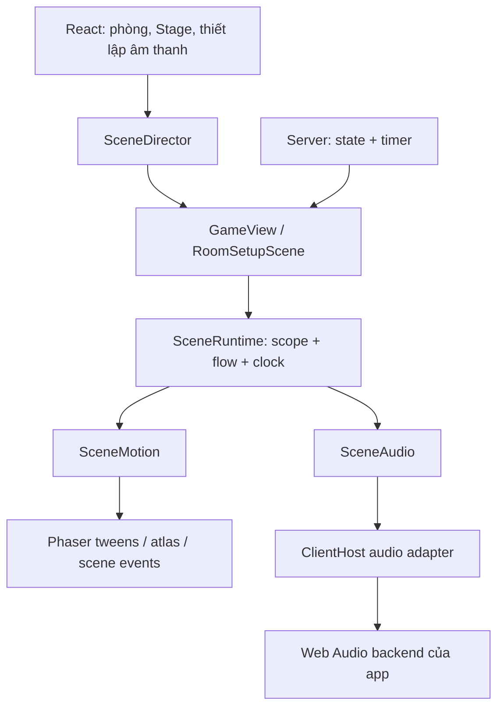

# Thiết kế phần mở rộng engine cho 0.9.1

Trạng thái: đã triển khai runtime, adapter âm thanh, director và migration bảy game. Nền tảng đối chiếu: `v0.9.0`, Phaser đang cài
trong repository và các luồng trình diễn của bảy game hiện có. Các interface công khai được export từ `@psc/sdk/client`; `Scope` và clock vẫn nội bộ.

Mục tiêu là để tác giả game viết một chuỗi hành động dễ đọc, còn engine chịu trách nhiệm về
vòng đời, hủy, thời gian, âm thanh và dọn tài nguyên. Phần mở rộng nằm ở SDK trình duyệt;
logic, bot, RNG, tiền, lượt và thời hạn vẫn do `Game` trên server quyết định.

## 1. Quyết định kiến trúc

Giữ Phaser làm nền tảng scene, tween và atlas. Thêm bốn module với trách nhiệm rõ ràng:

| Module | Quyền sở hữu | Trách nhiệm |
| --- | --- | --- |
| `SceneDirector` | Một Phaser game, do app tạo | Chuyển foreground, tải client, phân biệt từng lần mở phòng, bỏ kết quả tải cũ |
| `SceneRuntime` | Một lần scene chạy | Scope scene/ván, coroutine, lane, hủy, đồng hồ trình diễn, báo lỗi |
| `SceneAudio` | Voice theo scope; backend và cache theo app | Phát/dừng hiệu ứng, biết lúc bắt đầu/kết thúc, chuẩn bị âm thanh, duck nhạc |
| `SceneMotion` | Tween/atlas/frame callback theo scope | Hoạt ảnh có thể chờ, dừng, đổi tốc độ và dọn listener |

Game dùng `this.runtime` và context `fx` của mỗi coroutine. `SceneAudio` và `SceneMotion`
được runtime phối hợp; game không phải tự nối bốn manager hoặc gọi `update()` cho từng manager.
Không dùng singleton scene hay một bảng đăng ký manager toàn cục. App vẫn giữ một backend
âm thanh để tất cả game tuân theo cùng thiết lập âm lượng.



Đã cân nhắc ba hướng:

| Hướng | Đánh giá |
| --- | --- |
| Bọc riêng từng manager Phaser, vẫn để game tự ghép Promise | Ít thay đổi nhưng việc hủy, dọn tài nguyên và đồng bộ âm thanh vẫn lặp ở mỗi game |
| Tạo scene graph, scheduler generator và sound engine mới như Unity | Nhiều khái niệm, hai nguồn vòng đời và thêm công việc bảo trì |
| Runtime theo scope trên Phaser và backend âm thanh hiện tại | Chọn: gom các tình huống khó sau một interface nhỏ, giữ đối tượng Phaser và TypeScript quen thuộc |

Coroutine sử dụng `async/await`. Bản đầu không thêm cú pháp `yield`, ECS, animation state machine,
editor timeline, dependency injection container hoặc hệ thống scene additive cho game.

## 2. Những vấn đề cụ thể ở 0.9.0

- `GameView` được dùng lại giữa các phòng. Phaser dọn đối tượng nhưng các field của class vẫn
  tồn tại; Promise và callback ngoài Phaser cần cơ chế hủy riêng.
- Cờ tướng có `queue`, `generation`, `waiting`, helper tween và `setTimeout` dự phòng. Một
  timeout theo thời gian thực có thể kết thúc trước tween nếu scene bị pause hoặc chạy chậm.
- Cờ tỷ phú có `rollQueue`, `moneyQueue`, `beatClock`, `effectivePlaybackSpeed` và các mốc chờ.
  Âm thanh chuyển tiền mở đầu hoạt ảnh bằng `.then()`; cần ngăn callback của ván cũ tiếp tục.
- Tiến lên và Mậu binh xếp nhiều `delayedCall`, tween và callback cho chia/lật bài. Mỗi luồng
  phải tự kiểm tra liệu mình còn thuộc ván đang hiển thị.
- `ClientHost.playSound()` chỉ trả Promise lúc bắt đầu, chưa có handle để dừng. Backend giữ
  yêu cầu chờ decode, chưa gắn với scene hay có hạn chờ; yêu cầu cũ có thể phát sau khi tải xong.
- `PhaserStage.applyStage()` tải client bất đồng bộ và đọc lại Stage. Cần đóng gói quy tắc này,
  xử lý lỗi tải và phân biệt hai phòng cùng dùng một scene key.

Không đưa các phase riêng như `rolling`, `payment`, `decision`, luật nhà tù hay nội dung
thông báo vào SDK. Chúng vẫn thuộc game; SDK cung cấp cách chạy và hủy các bước trình diễn.

## 3. Interface dành cho tác giả game

Ví dụ một hành động được xếp sau các hành động trước trên lane `turn`:

```ts
const task = this.runtime.run(async (fx) => {
  await fx.sound('tycoon-jail');
  await fx.tween({
    targets: pawn,
    x: jail.x,
    y: jail.y,
    duration: 600,
    ease: 'Cubic.easeInOut',
  });
  await fx.wait(250);
  fx.checkpoint();
  showLanding();
}, {
  lane: 'turn',
  policy: 'queue',
  onFailure: () => redrawFromCurrentState(),
});
```

Âm thanh được yêu cầu tại bước bay vào tù, sau các bước xúc xắc trước đó. `fx.sound()` mặc định
chờ xác nhận bắt đầu hoặc bỏ qua âm thanh rồi mới tiếp tục. Việc khởi động tween diễn ra ở
nhịp trình diễn kế tiếp; đây là đồng bộ theo frame, không cam kết chính xác đến từng audio sample.

Interface lõi:

```ts
type FlowResult =
  | { status: 'completed' }
  | { status: 'cancelled'; reason: string }
  | { status: 'failed'; error: unknown };

interface FlowHandle {
  readonly done: Promise<FlowResult>;
  cancel(): void;
}

interface RunOptions {
  lane?: string;
  policy?: 'queue' | 'replace';
  lifetime?: 'round' | 'scene';
  onFailure?: (error: unknown) => void;
}

interface SceneRuntime {
  readonly audio: SceneAudio;
  run(body: (fx: FlowContext) => Promise<void>, options?: RunOptions): FlowHandle;
  cancelLane(lane: string): void;
  pending(lane: string): number;
  busy(lane: string): boolean;
  setSpeed(speed: number): void;
}

interface FlowContext {
  readonly signal: AbortSignal;
  wait(ms: number): Promise<void>;
  tween(config: FiniteTweenConfig): Promise<void>;
  animate(sprite: Phaser.GameObjects.Sprite, key: string): Promise<void>;
  sound(name: string, options?: {
    duck?: boolean;
    wait?: 'started' | 'finished';
    maxStartDelayMs?: number;
  }): Promise<void>;
  frame(update: (deltaMs: number) => boolean): Promise<void>;
  parallel(...branches: Array<(fx: FlowContext) => Promise<void>>): Promise<void>;
  defer(cleanup: () => void): void;
  checkpoint(): void;
}
```

`FiniteTweenConfig` là tập con có kiểu của `Phaser.Types.Tweens.TweenBuilderConfig`: giữ
`targets`, thuộc tính, easing, delay, yoyo, repeat hữu hạn và callback thông dụng. Không nhận
`paused: true`, `persist: true`, vòng lặp vô hạn hay `timeScale` riêng. Giá trị số về thời gian
phải hữu hạn, không âm. Kiểu timing dùng số hữu hạn; callback lấy giá trị thuộc tính vẫn theo Phaser.

- Không truyền `lane`: flow chạy độc lập. Truyền `policy` mà thiếu `lane` là lỗi cấu hình.
- Có `lane`: mặc định `queue`; FIFO, một flow chạy tại một thời điểm. Tên lane thuộc runtime,
  gắn với scope của các flow trong lane. Trộn hai lifetime trên cùng lane là lỗi cấu hình;
  `pending()`/`busy()` vì thế luôn có một lane xác định để đọc.
- `replace`: hủy flow hiện tại và tất cả flow đang chờ trên cùng lane; thích hợp cho highlight,
  camera và kéo thả. Flow mới bắt đầu sau khi flow cũ thoát và cleanup hoàn tất.
- `pending()` chỉ đếm flow chờ; `busy()` tính cả đang chạy. Game chọn tăng tốc theo backlog;
  runtime không tự suy đoán hành động nào được bỏ.
- `lifetime` mặc định `round` trong `GameView`, `scene` trong setup. Dùng `scene` cho hiệu ứng
  trang trí tồn tại qua nhiều ván, không dùng nó cho di chuyển, tiền hoặc kết quả ván.
- `FlowHandle.done` luôn resolve với kết quả có kiểu. Có thể bỏ qua handle mà không tạo
  unhandled rejection. Lỗi bên trong flow vẫn được báo; không coi lỗi lập trình là hoàn thành.
- `cancel()` và `cancelLane()` gọi nhiều lần vẫn an toàn. Tác vụ đã kết thúc không thay kết quả.

`parallel()` nhận factory thay vì Promise đã khởi chạy. Mỗi nhánh có scope con. Khi một nhánh
lỗi hoặc bị hủy, dừng các nhánh còn lại, chờ cleanup rồi trả lỗi/hủy cho flow cha. Scope cha
không được hoàn thành khi còn tài nguyên của nhánh con chưa được dọn.

```ts
this.runtime.run(async (fx) => {
  const flash = makeFlash();
  fx.defer(() => flash.destroy());
  await fx.parallel(
    async (child) => { await child.tween({ targets: pawn, y: targetY, duration: 350 }); },
    async (child) => { await child.sound('impact', { wait: 'finished' }); },
  );
});
```

`defer()` dành cho object tạm/listener do game tạo, chạy đúng một lần theo thứ tự ngược khi
flow hoàn thành, lỗi hoặc bị hủy. Cleanup đồng bộ, không gửi nước đi và không render state mới;
chỉ dọn tài nguyên mình sở hữu. Một cleanup lỗi không ngăn các cleanup còn lại chạy.

`frame()` phục vụ Dice3D, đường đi quân và hiệu ứng tiền tự vẽ: gọi update mỗi frame đang hoạt
động, truyền delta đã scale, trả `true` để hoàn thành. Callback lỗi làm flow thất bại. Thời gian
kết thúc của hiệu ứng hữu hạn do callback tích lũy delta; không cần một timer thứ hai.

## 4. Vòng đời và hủy tác vụ

Cây quyền sở hữu: **app → lần chạy scene → ván → flow → nhánh → tween/voice/listener**.
Một lần chạy scene có epoch mới; chơi ván mới có epoch ván mới. Epoch là nội bộ, game không
tự tăng `generation` nữa. Tài nguyên cache không nằm trong cây flow.

| Sự kiện | Hành vi |
| --- | --- |
| Scene bắt đầu | Tạo runtime và scope trước `onCreate()` / `build()` |
| `round` đổi | Hủy scope ván cũ, tạo scope mới trước `onStart()`; giữ scope scene |
| Ván kết thúc | Giữ scope ván để trình diễn nước cuối và kết quả; kết thúc không đồng nghĩa hủy |
| Scene shutdown | Đóng scope và hủy đồng bộ các tài nguyên; scene có thể chạy lại với runtime mới |
| Scene destroy / app unmount | Dọn toàn bộ, kể cả director và subscription; không dùng lại runtime |
| Pause / sleep / tab bị ẩn | Dừng tiến trình trình diễn; dừng hiệu ứng âm thanh ngắn, không phát lại tiếng cũ |
| Resume / wake / tab hiện lại | Tiếp tục nếu cùng epoch và state còn liên tục; nếu cần resync thì dựng snapshot hiện tại |
| Resize | Giữ flow có thể tự đổi tọa độ; game hủy lane bị ảnh hưởng và đặt lại object nếu cần |

Runtime được gắn tự động bởi `GameScene`; `GameView` điều khiển scope ván, `RoomSetupScene`
chỉ cần scope scene. Hook hiện tại vẫn đồng bộ; không đổi `onState()` thành Promise và không
chặn socket trong lúc coroutine chạy. `ctx` tiếp tục nhận state mới.

Mỗi lần create, SDK cũng reset field nội bộ như `pendingOptions`, timer, clock và sequence.
Scope dọn tài nguyên đã đăng ký; không tự reset field tùy ý hoặc hủy object lâu dài của game.
Game vẫn tạo/reset các field hiển thị trong `onCreate()` và dựng lại chúng khi bắt đầu ván.

Khi hủy: đánh dấu scope đóng trước, abort signal, dừng tài nguyên và ngăn callback tạo hiệu ứng
mới, reject các primitive đang chờ bằng lỗi hủy nội bộ, để body thoát qua `finally`, chạy cleanup,
rồi settle handle. Không dựa vào thứ tự Phaser tự dọn tween/timer: runtime giữ registry riêng
và lắng nghe shutdown/destroy; director chủ động đóng runtime trước khi gọi stop scene.

JavaScript không thể cưỡng chế dừng một hàm async tùy ý. Cam kết tự hủy áp dụng cho primitive
SDK và tài nguyên được đăng ký. Khi cần chờ một thao tác ngoài SDK, truyền `fx.signal` nếu nó
hỗ trợ abort và gọi `fx.checkpoint()` ngay sau `await`, trước khi đụng object/state hoặc gửi nước
đi. Runtime quan sát rejection của mọi body nhưng không tuyên bố hủy được Promise bên ngoài.

Promise đã resolve cũng không thể bị thu hồi. Trước side effect trực tiếp sau một `await`,
chẳng hạn `showLanding()` ở ví dụ trên hoặc `send('event-ready')`, gọi `fx.checkpoint()` ngay
trước side effect để chặn race completion → đổi ván → continuation. Primitive SDK tự kiểm tra
scope khi được gọi; callback game đã đăng ký qua tween/frame cũng được bảo vệ. Không hứa
rằng runtime có thể ngăn mọi câu lệnh JavaScript trong body nếu tác giả bỏ qua quy tắc này.

Không cho flow cũ còn chạy chồng flow `replace` mới trên cùng lane. Flow ngoài SDK bị treo thì
lane đó chưa được mở lại; báo chẩn đoán trong DEV, không giả vờ hoàn thành rồi cho hai body
cùng ghi lên object. Migration phải loại các Promise chờ vô hạn không có cơ chế abort.

Callback tween/frame được bọc kiểm tra scope trước khi gọi code game. Việc stop, destroy hoặc
thay thế target là hủy với lý do `target-lost`/`replaced`, không thành công; code sau `await`
phải xử lý hủy, không cập nhật như thể quân đã đến đích. Chỉ stop tween/voice do scope sở hữu, không dùng
`killAll()` hay tắt âm thanh của game/app khác.

## 5. Đồng hồ và tốc độ

| Đồng hồ | Dùng cho | Ảnh hưởng bởi `setSpeed()` |
| --- | --- | --- |
| Presentation delta | `wait`, tween, atlas, `frame` | Có |
| Monotonic real time | Deadline tải/decode và hạn bắt đầu âm thanh | Không |
| Deadline server trong `ctx.timer` | Xác nhận event, lượt, hành động bot | Không |

Runtime lấy delta từ lifecycle Phaser, độc lập với `GameView.onUpdate()`. Wait và callback
frame dùng delta đã scale; tween và atlas dùng timeScale riêng trên đúng tài nguyên được quản lý.
Không vừa scale duration vừa scale delta. Không thay `scene.tweens.timeScale`, `scene.time.timeScale`
hay animation global timeScale: điều đó có thể kéo theo HUD hoặc hiệu ứng chưa migrate.

`setSpeed()` nhận số hữu hạn trong khoảng 0.25–4, mặc định 1. Thay đổi áp dụng cả hiệu ứng đang
chạy, không nhảy về đầu. Giá trị ngoài khoảng là lỗi cấu hình. Giá trị 0 không thay thế pause.
Pause/sleep/visibility do vòng đời điều khiển. Sang ván mới giữ tốc độ người chơi đã chọn trong
lần mở scene đó; sang lần chạy scene khác trở về mặc định, game có thể khôi phục lựa chọn riêng.

Delta được xử lý một lần mỗi frame, chặn tối đa 100 ms mỗi frame để tránh hoạt ảnh nhảy khi
thiết bị khựng. Mốc này là hằng nội bộ có kiểm thử. Khi tab hiện lại, bỏ khoảng thời gian ẩn;
việc bắt kịp server dùng resync hoặc tăng tốc do game chọn. Không dùng thời gian ẩn để chạy
hàng chục hiệu ứng và âm thanh trong một frame.

Primitive thành công được settle ở nhịp runtime đang hoạt động, không mở bước trình diễn kế
tiếp từ callback decode trong lúc tab/scene đang pause. Hủy vẫn giải phóng và reject bước chờ
ngay cả khi scene không có frame. Real-time deadline âm thanh vẫn hết hạn trong thời gian ẩn.

Chờ server không dùng `fx.wait()`: đếm ngược vẫn vẽ bằng `ctx.timer.endsAt` như hiện nay.
Cờ tỷ phú chỉ human có countdown cho event đặc biệt; bot xác nhận qua luật server. Rent và
thưởng qua Xuất phát tiếp tục liền mạch. Không trì hoãn tác động tiền bằng scheduler trình duyệt.

## 6. Âm thanh: cache chung, mỗi lượt phát có handle

Interface trực tiếp khi không cần coroutine:

```ts
type SoundStart =
  | { status: 'started' }
  | { status: 'skipped'; reason: 'muted' | 'blocked' | 'missing' | 'late' | 'unavailable' }
  | { status: 'cancelled' };

type SoundFinish = { status: 'ended' | 'stopped' | 'skipped' };

interface SoundHandle {
  readonly started: Promise<SoundStart>;
  readonly finished: Promise<SoundFinish>;
  stop(): void;
}

interface SceneAudio {
  prepare(names: readonly string[]): Promise<ReadonlyArray<{
    name: string;
    status: 'ready' | 'unavailable';
  }>>;
  play(name: string, options?: {
    duck?: boolean;
    maxStartDelayMs?: number;
  }): SoundHandle;
}
```

`audio.play()` là hiệu ứng ngắn trực tiếp, thuộc scope mặc định của scene; trong `GameView` là
scope ván. `fx.sound()` gọi cùng module nhưng đăng ký voice vào flow; mặc định chờ `started`,
`wait: 'finished'` chờ hết tiếng. Âm thanh bị skip không làm flow lỗi. Hủy flow dừng voice và
hủy bước chờ, không chạy bước sau. Handle trực tiếp luôn settle, kể cả gọi stop trước decode.

Quy tắc vận hành:

1. Cache buffer, request tải và decode được coalesce theo URL ở backend app. Mỗi lần phát tạo
   source node riêng; các caller không chia sẻ một voice. Đường dẫn asset theo `gameId/name`.
2. `prepare()` tải/decode trước, không phát. Deadline mặc định 3 giây theo real time, trả
   `unavailable` nếu chưa sẵn sàng; có thể thử lại. Decode hoàn tất muộn chỉ làm ấm cache.
   Việc tạo/resume AudioContext phải được kiểm tra trên browser thực, không giả định preload
   đồng nghĩa đã được phép phát.
3. Chưa unlock, đang mute hoặc context không chạy: skip ngay. Không gom âm thanh rồi phát
   dồn khi người chơi bật tiếng hoặc tương tác lần đầu.
4. Đã unlock nhưng chưa decode: hạn bắt đầu mặc định 250 ms kể từ yêu cầu. Hết hạn thì skip,
   xóa yêu cầu phát; không phát bù khi buffer tải xong. Game vẫn tiếp tục hoạt ảnh khi im lặng.
5. Stop trước start xóa yêu cầu; stop sau start dừng và disconnect node. `started` và `finished`
   settle đúng một lần. Listener và duck token được dọn cả trên kết thúc tự nhiên lẫn stop.
6. Duck nhạc dùng token theo từng voice, lấy mức duck mạnh nhất còn hiệu lực. Hai jingle
   chồng nhau không khôi phục nhạc sớm. Gain hiện tại được tính từ setting mới nhất, tránh
   tiếng nhạc bật trở lại sau khi người chơi mute hoặc đổi âm lượng giữa jingle.
7. Nhạc nền tiếp tục do app chọn theo Stage, không nằm trong scope ván. Bản đầu không thêm
   nhạc riêng tùy ý, loop vô hạn hay đổi playback rate âm thanh theo tốc độ trình diễn.
8. Giới hạn nội bộ: 32 voice và 64 yêu cầu phát đang chờ cho mỗi backend. Khi hết
   chỗ, skip yêu cầu mới, không tự cắt tiếng đang phát. Các số này phải được kiểm chứng qua
   cảnh chia bài/cờ tỷ phú; caller không cần chỉnh chúng.

Thay seam host bằng contract cung cấp chuẩn bị âm thanh và handle phát/dừng. Web app dùng
Web Audio adapter; test dùng adapter giả điều khiển start/end/failure. Cả hai đi qua cùng
interface. Đặt kiểu handle trong SDK, không import kiểu/module app vào game.

Giữ `sfx(name): Promise<void>`, `jingle(name): void` và `anim(name): string` tương thích về kiểu.
`sfx` resolve tại start hoặc skip và `jingle` duck như cũ, nhưng voice được scope sở hữu.
Hành vi bỏ yêu cầu phát quá trễ là thay đổi có chủ ý, phải ghi trong hướng dẫn và release notes.
Các flow cần hủy toàn bộ phần tiếp theo chuyển từ `await this.sfx()` sang `await fx.sound()`.

## 7. Hoạt ảnh và tranh chấp target

`SceneMotion` giữ Promise, callbacks, listener stop/destroy và timeScale; game vẫn giữ đối tượng
Phaser và thuật toán đường đi. Không bọc mọi hàm drawing hay viết lại interpolator của Phaser.

- Tween hữu hạn hoàn thành qua tín hiệu completion; dừng/destroy/hủy đều settle bằng hủy.
  Không dùng timeout ước lượng `duration + delay` để giả lập completion.
- Atlas một lần: chờ animation đúng key kết thúc, lắng nghe stop/target destroy, gỡ listener.
  Config atlas được đăng ký với key có namespace và cấu hình nhất quán; dùng cùng key nhưng
  frameRate/repeat khác phải báo lỗi trong DEV hoặc tạo key khác, không lặng lẽ lấy config cũ.
- Không `await` atlas lặp vô hạn. Hiệu ứng trang trí có thể dùng Phaser trực tiếp trong scope
  scene; đăng ký cleanup bằng flow nếu game tạo tài nguyên bên ngoài lifecycle Phaser.
- Mỗi target chỉ có một managed tween ghi thuộc tính tại một thời điểm; mỗi sprite có một
  managed atlas. Tween mới thay tween cũ và hủy flow sở hữu bước cũ. Muốn di chuyển + đổi alpha
  trên cùng target thì gộp một config; muốn song song, dùng target riêng hoặc object proxy.
- Tween nhiều target chiếm quyền trên tất cả target. Target bị hủy làm hủy cả bước.
- Callback game được giữ và gọi đúng một lần theo sự kiện thực, không ghi đè `onComplete`
  rồi bỏ callback cũ. Callback không được gọi sau khi scope đóng, kể cả callback stop.
- Sau migration, không vừa dùng SDK vừa `this.tweens.add()/killTweensOf()` trên cùng target.
  Trong giai đoạn chuyển đổi, mỗi target phải có một bên sở hữu. Với resize, game hủy lane
  trước khi setPosition và dựng lại snapshot, hoặc tính vị trí từ progress bằng `fx.frame()`.

## 8. Chuyển scene và cập nhật snapshot

Interface dành cho app, không dùng để game điều hướng phòng:

```ts
interface SceneRequest<Data> {
  key: string | null;
  instance: string;
  data: Data;
}

interface SceneDirector<Data> {
  show(request: SceneRequest<Data>): Promise<{
    status: 'shown' | 'superseded' | 'failed';
  }>;
  dispose(): void;
}
```

App cung cấp loader scene class, tập background (`boot`, `sky`), thao tác ghi registry trước
start, thao tác đẩy props sau start và callback báo lỗi. `Data` là `Stage` ở app; SDK không
import `Stage`, React, router hoặc registry game. `instance` do app tạo từ lần mở phòng/setup/
sandbox, không phải chỉ `gameId` hoặc số ván. Đây là metadata local, không đổi socket protocol.

- Cùng key và instance: cập nhật data mới nhất, không restart. Nếu đang preload, registry
  phải chứa data mới nhất trước create, rồi đẩy cập nhật nếu có thay đổi trong lúc khởi tạo.
- Cùng key nhưng instance khác: hủy scope và stop lần chạy cũ, mở lần mới. Hai phòng cùng
  game không được chia sẻ flow, options pending hay trạng thái đã vẽ.
- Mỗi yêu cầu có revision. Load client được coalesce; kết quả revision cũ không được start
  scene hay ghi registry. Dynamic import không cần hủy vật lý, chỉ bỏ quyền áp dụng kết quả.
- Chuyển foreground đóng runtime trước khi stop; không stop background. Các thao tác scene
  được serialize qua lifecycle Phaser, tránh stop/start cùng scene đang preload ở hai callback.
- Lỗi tải báo qua callback app và kết quả `failed`; không có rejection bị bỏ quên hoặc retry
  vô hạn. UI thử lại dùng Stage mới nhất, không closure của phòng cũ.
- `dispose()` vô hiệu revision, gỡ subscription, đóng scope, không áp dụng kết quả tải muộn.

`GameView.receive()` vẫn nhận state ngay. Với dòng sự kiện liên tục, game chụp dữ liệu trình
diễn cần thiết tại enqueue; không đọc `this.ctx.state` muộn để đoán nước đi cũ. Sau mỗi beat
đồng bộ các field hiển thị; snapshot server luôn là điểm khôi phục khi lỗi.

Khi reconnect hoặc `last.seq` nhảy qua nhiều nước, SDK không có lịch sử đầy đủ để dựng từng
animation. Đề xuất hook đồng bộ `onResync(ctx)` trước `onState()`: hủy flow ván, tạo scope mới
cùng round, bỏ replay event thiếu tiền đề, game dựng lại snapshot không phát tiếng cũ. Trường
hợp mở scene giữa ván cũng dựng snapshot, giữ lifecycle hiện tại không giả lập `onStart()`.
Hook mới phải được tài liệu hóa và migrate trong cùng thay đổi. Chưa thêm giao thức replay.

## 9. Lỗi, giới hạn và quan sát

- Flow lỗi dừng tài nguyên của nó và báo đúng một lần kèm game/scene, epoch, lane, bước.
  `onFailure` chỉ được gọi nếu scope còn hiện hành để game dựng snapshot mới nhất. Nếu callback
  khôi phục lỗi, báo riêng; không retry tự động. Hủy bình thường không gọi `onFailure`.
- Lane mặc định có tối đa 64 flow chờ. Overflow: hủy lane, từ chối flow mới với kết quả
  `failed`, gọi `onFailure` của yêu cầu mới để khôi phục snapshot; không âm thầm mất một nước.
  Cờ tỷ phú/Cờ tướng dùng callback này. Runtime không tự biết cách redraw một game.
- FIFO tiếp tục sau lỗi đã được dọn. Game có thể hủy lane trong callback khôi phục nếu các
  beat tiếp theo đã mất tiền đề. Flow khác lane vẫn chạy.
- Không đăng ký một listener hoặc timer native cho mỗi frame. Dùng một update subscription
  mỗi runtime, collection cho wait/frame và remove ngay khi settle.
- DEV cho xem lane đang chạy, số flow chờ, số tween/voice/wait, lý do skip âm thanh và epoch.
  Không thêm overlay cho người chơi; tích hợp nút DEV hiện có khi triển khai. Log không chứa
  bài/deck hoặc snapshot riêng tư. Production chỉ báo lỗi, không trace mỗi frame.
- Sau shutdown, registry tài nguyên runtime phải bằng 0. Backend được giữ buffer cache có
  ngân sách riêng; không giữ closure tham chiếu scene/game view trong cache.

## 10. Vị trí mã và thứ tự triển khai

```text
packages/sdk/src/client/
  runtime/
    SceneRuntime.ts          interface và wiring scope
    Flow.ts                  coroutine, lane, kết quả, cleanup
    Scope.ts                 sở hữu, abort, epoch
    PresentationClock.ts     wait/frame/tốc độ
    SceneAudio.ts            voice theo scope và tên asset
    SceneMotion.ts           tween/atlas hữu hạn
    *.test.ts                kiểm thử qua interface
  SceneDirector.ts           chuyển foreground; generic theo dữ liệu app
  host.ts                    contract backend âm thanh
  GameScene.ts               tự gắn runtime, helper tương thích
  GameView.ts                vòng đời ván và onResync
  RoomSetupScene.ts          vòng đời setup
apps/web/src/
  lib/sound.ts               cache, decode, handle, gain và duck token
  phaser/PhaserStage.tsx     dùng director, mapping Stage và instance
```

Không export `Scope`, epoch, clock adapter hoặc state machine scheduler cho game. Chỉ export
kiểu game/app cần qua `@psc/sdk/client`; không đưa module trình duyệt vào entry server `@psc/sdk`.

Triển khai theo các thay đổi có thể review và kiểm chứng riêng:

1. **Lõi runtime và vòng đời:** scope/flow/lane/clock, gắn vào scene/setup, ví dụ Bấm nút và
   Cờ cá ngựa. Giữ hook và cơ chế gửi nước đi hiện tại.
2. **Âm thanh và motion:** handle Web Audio, cache/deadline/duck, primitive tween/atlas/frame;
   migrate helper tương thích. Kiểm chứng audio bị block/mute/decode trễ trước game phức tạp.
3. **Director:** đưa điều phối Stage vào module; thêm identity local cho room/setup/sandbox;
   kiểm chứng chuyển màn khi load chậm, cùng game khác phòng và unmount.
4. **Migration game:** lần lượt chuyển ownership, bỏ helper scheduler trùng lặp sau khi hành
   vi tương đương. Cập nhật header SDK, `games/counter/README.md`, `docs/making-a-game.md` và
   template tạo game trong cùng thay đổi interface.
5. **Hoàn thiện release:** kiểm thử tích hợp, dọn code cũ, mô tả thay đổi âm thanh trễ. Dùng
   release-please cho mốc 0.9.1 đã thống nhất; nếu PR có `feat`, đặt `Release-As: 0.9.1` để
   không bị tự tăng minor trước 1.0. Không sửa version/CHANGELOG bằng tay.

| Game | Migration và tiêu chí giữ hành vi |
| --- | --- |
| Bấm nút (`counter`) | Flow tween nút; vẫn gửi/phát tiếng một lần, dùng làm ví dụ tối thiểu |
| Cờ cá ngựa (`co-ca-ngua`) | Chuyển tween phản hồi hiện tại, không bổ sung luật cho game đang WIP |
| Caro (`tic-tac-toe`) | Lane riêng cho đặt quân/kết quả và camera/highlight; không chặn pan/zoom bởi animation lượt |
| Cờ tướng (`xiangqi`) | Thay queue/generation/helper tween/wait; giữ tăng tốc backlog, cut-in, vỡ quân và kết quả sau nước cuối |
| Tiến lên (`tien-len`) | Chia/lật bài thành flow và nhánh theo quân bài; giữ thứ tự chia, thông báo và standings |
| Mậu binh (`mau-binh`) | Thay callback hẹn giờ/generation khi chia/lật/so bài; giữ thao tác xếp bài và countdown server |
| Cờ tỷ phú (`co-ty-phu-classic`) | Flow lượt và chuyển tiền, frame cho xúc xắc/hiệu ứng, giữ snapshot tài sản riêng của game; tiếng tù ở đầu flight; chỉ event đặc biệt của human có xác nhận/countdown |

Migration bao gồm helper phụ như `cutin.ts`, `Card.ts`, `Callout.ts`, effect và result panel,
không chỉ đổi file `*View.ts`. Các object dài hạn vẫn thuộc Phaser; scheduler và callback có
thể sống qua ván mới phải chuyển sang scope. Giữ unit test luật game hiện tại.

## 11. Tiêu chí chấp nhận và kiểm thử

Test chạy qua interface công khai với clock/audio adapter giả có thể điều khiển; browser test
kiểm chứng wiring Phaser/Web Audio thật. Không chỉ mock manager rồi kiểm tra tên hàm được gọi.

| Nhóm | Tình huống bắt buộc |
| --- | --- |
| Coroutine | FIFO, lane độc lập, replace, cancel trước start/đang wait/đang tween, hủy nhánh parallel, cleanup LIFO, callback lỗi, overflow và phục hồi |
| Vòng đời | New round trước hook, kết quả sau nước cuối, stop/restart cùng instance class, khác phòng cùng game, setup quay lại, dispose trong lúc import/preload |
| Thời gian | Đổi tốc độ giữa tween/wait/frame/atlas, pause/sleep/visibility, delta lớn, không double-scale, countdown server không đổi |
| Motion | Complete/stop/destroy đều settle, thay target owner, resize, callback một lần, loop vô hạn bị từ chối, không còn listener sau shutdown |
| Audio | Cache hit/miss, coalesce, cancel trước/sau decode/start, muted/locked/hidden/unavailable, deadline, hai voice cùng buffer, duck chồng nhau và đổi setting giữa jingle |
| State | Seq gap/reconnect không replay tiếng cũ, snapshot cập nhật trong khi flow chạy, không gửi event-ready của ván đã đóng |

Ví dụ hồi quy quan trọng: vào event đặc biệt → rời phòng trong khi chờ tiếng; decode xong
sau đó không phát voice, không hiện dialog, không gửi event-ready. Ví dụ khác: chơi ván mới
giữa cut-in/chia bài thì không còn callback nào ghi lên object của ván mới.

Sau migration, chạy `npm run check` và một lần `npm run e2e -- --changed origin/main` với
server riêng, headless; thay SDK khiến nhiều scenario cùng được chọn. Mỗi game có luồng đã
migrate phải thử trong sandbox và xem screenshot. Kiểm tra tài nguyên về 0 sau nhiều vòng
room → setup → board → new round → leave; bổ sung scenario cho race tải scene và audio trễ.
Kiểm chứng thiết bị/browser thật cho unlock/visibility trước release; headless Chromium không
đủ để kết luận Safari/iOS hoạt động tương đương. Không yêu cầu thao tác đó để hoàn thành bản
triển khai này.

## 12. Ghi chú triển khai

- Motion dùng tween được `scene.tweens.create()` tạo, không thêm vào TweenManager, rồi update
  bằng delta presentation đã chặn; giữ interpolator/callback Phaser và tránh scale hai lần.
  Atlas giữ timeScale riêng bằng 0 ngoài nhịp runtime, được update một lần trong nhịp presentation.
- `runtime.tween`/`after` là dạng ngắn cho flow phản hồi UI độc lập; game nhiều vòng gọi
  `newRound('game-round')` trước khi thay bài. Choreography dài dùng `run`/`parallel`.
- Backend giới hạn 32 source đang phát, 64 yêu cầu chờ decode; cache LRU tối đa 64 MiB.
  Runtime và âm thanh có metadata trong mục Runtime của DEV, không chứa snapshot/bài.
- Regression `scripts/e2e/scenarios/engine-runtime.mjs` kiểm chứng tween/atlas thật, hủy voice
  decode trễ, duck chồng nhau và scene identity/import/dispose. Test SDK dùng clock/audio giả
  để kiểm chứng flow/lane/parallel/overflow/pause/round qua interface công khai.
  `runtime-sandbox.mjs` chơi cả bảy game, hủy chia bài khi đổi ván/vào setup và chờ Mậu binh so bài xong.
- `onResync` áp dụng khi seq nhảy, đổi người xem hoặc vừa mở scene bằng snapshot đã có nước đi/kết quả. Reconnect mở một instance local mới;
  snapshot giữa ván không giả lập các nước bị mất. Unlock/visibility Safari/iOS vẫn cần kiểm
  chứng trên thiết bị trước release. Không sửa version hay CHANGELOG thủ công.

## 13. Nguồn đối chiếu

- Mã hiện tại: `packages/sdk/src/client/{GameScene,GameView,RoomSetupScene,host}.ts`,
  `apps/web/src/{lib/sound.ts,phaser/PhaserStage.tsx}`, view và helper của các game trong bảng
  migration. Source Phaser cài trong `node_modules/phaser/src/` dùng để kiểm tra event ordering.
- [Phaser: Scenes](https://docs.phaser.io/phaser/concepts/scenes) phân biệt shutdown/destroy.
  Thiết kế scope mới cho mỗi lần chạy dựa trên vòng đời này.
- [Phaser 4: Timeline](https://docs.phaser.io/api-documentation/4.0.0/class/time-timeline) ghi
  rằng timeScale của timeline không tự scale tween. Vì vậy runtime quản lý tốc độ từng loại
  tài nguyên thay vì giả định một timeline đã đồng bộ tất cả.
- [MDN: AudioBufferSourceNode](https://developer.mozilla.org/en-US/docs/Web/API/AudioBufferSourceNode)
  nêu source node chỉ phát một lần, còn buffer có thể dùng lại. Đây là cơ sở tách cache và voice.
- [MDN: AbortSignal.throwIfAborted](https://developer.mozilla.org/en-US/docs/Web/API/AbortSignal/throwIfAborted)
  là cơ sở cho checkpoint; quyền hủy code ngoài primitive SDK là hợp tác, không cưỡng chế.

Các giới hạn, tên module, lane và chính sách phục hồi ở trên là quyết định thiết kế của dự án,
không phải cam kết sẵn có của Phaser hay Web Audio. Khi triển khai phải đối chiếu lại bản
Phaser cài thực tế và kiểm chứng qua adapter cùng browser test.
