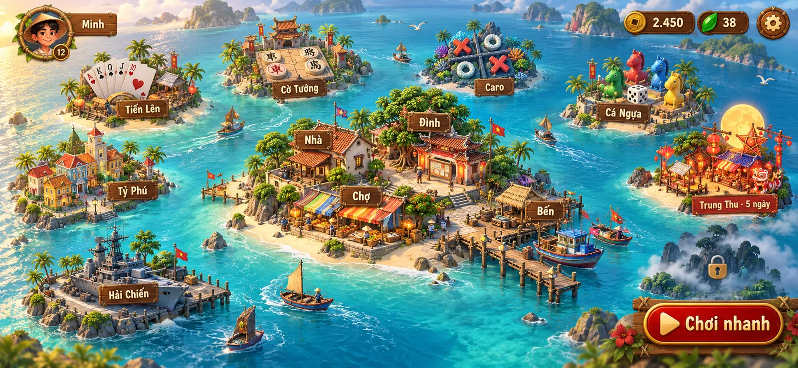
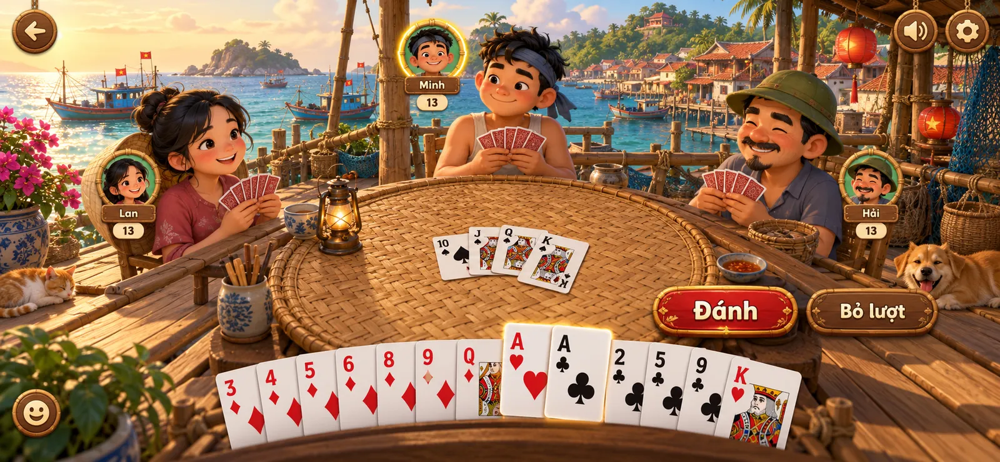
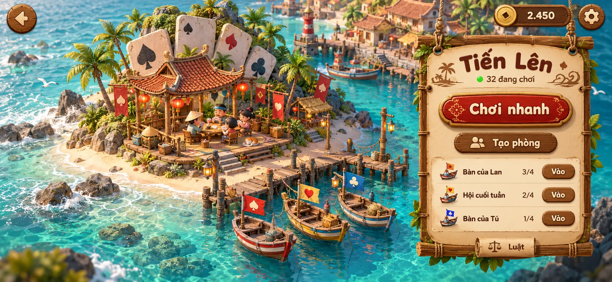
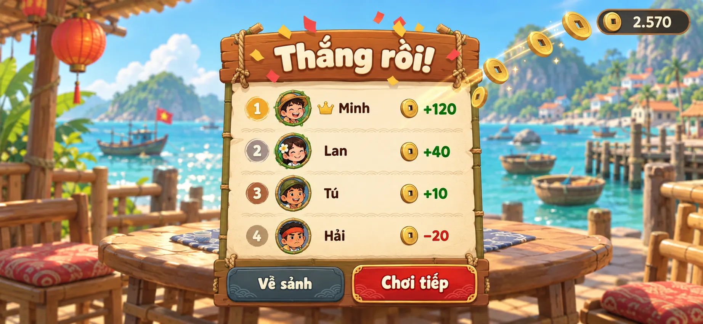
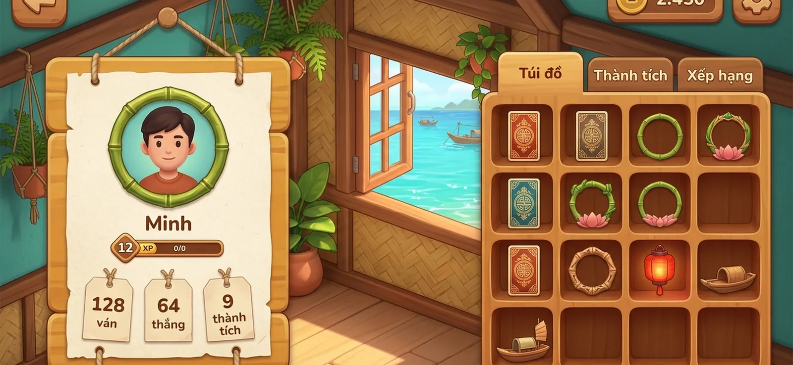
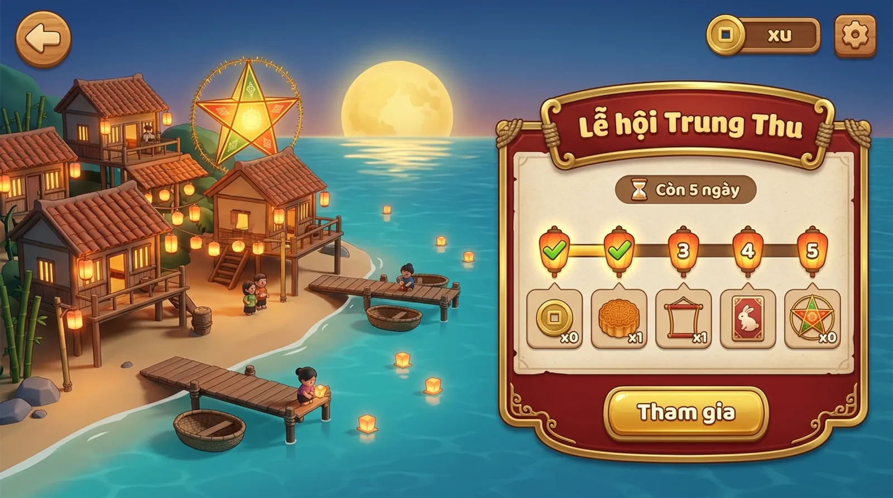
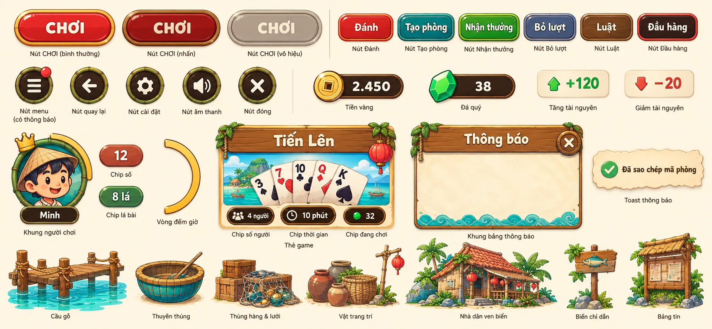

# Xóm Đảo: khung trải nghiệm

> Trạng thái: Phase 0, bản nháp chờ duyệt. Đây là cái khung chung mà hub và **mọi** trò, sự kiện
> sau này phải khớp: thế giới được tổ chức thế nào, HUD nằm đâu, người chơi vào một trò ra sao,
> phần thưởng hiện thế nào, và mọi thứ trông ra sao. Nó không mô tả luật của trò nào.
>
> Ảnh concept trong tài liệu này cho thấy **hướng đi**, không phải bản vẽ chính xác tới từng điểm
> ảnh. Chữ, số và bố cục cụ thể do các bảng và quy tắc bên dưới quyết định. Prompt tạo ảnh:
> [concepts/prompts.json](concepts/prompts.json).
>
> Tầm nhìn: [vision.md](vision.md). Kế hoạch: [roadmap.md](roadmap.md).
>
> Bốn ảnh hub, cận cảnh đảo, ván đấu và kết quả làm bằng Codex, đúng hướng nghệ thuật nhất. Ba ảnh
> Nhà, sự kiện và bộ thành phần làm bằng `agy` khi Codex hết quota: chúng phẳng hơn và ít chi tiết
> hơn, chỉ dùng để xem bố cục; sẽ làm lại bằng Codex.

## Nguyên tắc

1. **Là game, không phải app.** Không thanh tab, không thanh ngang phủ kín mép trên, không nút
   phẳng. Menu là những nơi chốn trong thế giới; bảng là biển gỗ; tiền là đồng xu.
2. **Trò chơi làm chủ phần giữa màn hình.** Phần khung (shell) chỉ dùng bốn góc. Trò không vẽ lại
   những gì phần khung đã có.
3. **Hai lần chạm để vào chơi.** Từ hub: chạm đảo → "Chơi nhanh". Hoặc một lần: nút "Chơi nhanh"
   ở hub vào trò chơi gần nhất.
4. **Một ngôn ngữ hình ảnh.** Mọi trò, mọi sự kiện dùng chung vật liệu, bảng màu, font, nút và âm
   thanh giao diện. Mỗi đảo được có "chất" riêng trong phần thế giới của nó, không phải trong HUD.
5. **Mọi chuyển cảnh đều có chuyển động.** Không màn trắng, không vòng xoay tải giữa màn hình. Lúc
   tải gói của trò là lúc camera bay tới đảo.

## Thế giới: Xóm và các đảo



Hub là một quần đảo nhìn từ trên xuống, hơi nghiêng. Người chơi kéo để di chuyển, chụm hai ngón
để phóng to thu nhỏ, chạm để chọn.

| Phần | Là gì | Chứa |
| --- | --- | --- |
| **Xóm** (đảo giữa) | Đảo cố định, luôn ở trung tâm | Các nơi chốn (`place`) của nền tảng |
| **Đảo trò chơi** | Mỗi trò (`table`) một đảo nhỏ | Một diorama đồ chơi nói lên trò đó + biển tên gỗ |
| **Đảo sự kiện** | Mỗi sự kiện (`event`) một đảo, chỉ có khi đang mở | Phát sáng, có cờ hiệu và số ngày còn lại |
| **Đảo sương mù** | Trò `wip` hoặc chỗ trống cho trò sau | Sương và ổ khoá, không chạm vào được |

Các nơi chốn trong Xóm:

| Nơi | Thay cho | Mở ra |
| --- | --- | --- |
| **Nhà** | Tab "Hồ sơ" | Hồ sơ, túi đồ, thành tích, xếp hạng |
| **Chợ** | Cửa hàng | Mua đồ trang trí bằng xu |
| **Đình** | Bảng tin | Tin tức, sự kiện, bảng xếp hạng chung |
| **Bến** | Tab "Phòng", "Bạn bè" | Bạn bè đang online, lời mời, mọi phòng đang mở |

Vị trí các đảo do plugin khai báo (ô trên lưới bản đồ). Thêm trò là thêm một đảo; không ai vẽ lại
bản đồ. Biển tên đảo chỉ có tên ngắn; số người đang chơi hiện khi chọn đảo.

## Đường đi của người chơi

```
Mở game ─► Hub (quần đảo)
              │ chạm đảo                      │ chạm nơi chốn trong Xóm
              ▼                               ▼
          Cận cảnh đảo + biển gỗ         Nhà / Chợ / Đình / Bến
              │ Chơi nhanh / Tạo phòng / Vào
              ▼
          Bàn chơi (ván đấu)
              │ hết ván
              ▼
          Kết quả + phần thưởng ─► Chơi tiếp (ván mới, cùng phòng)
              │ Về đảo
              ▼
          Cận cảnh đảo ─► ← về Hub
```

- Nút ← luôn về đúng một bước. Không có nút "Trang chủ" riêng: từ ván đấu về hub là hai lần ←
  (có hỏi xác nhận nếu đang giữa ván).
- Link mời bạn bè mở thẳng vào phòng, bỏ qua hub. Thoát ra thì về cận cảnh đảo của trò đó.

## Khung hình

Giữ hệ khung của [ui-guide.md](ui-guide.md#khung-hình): thiết kế trên khung **cao 720 đơn vị**, lõi
**960 × 720** luôn thấy được, màn rộng hơn chỉ thêm chỗ hai bên. Chỉ chơi màn hình ngang.

Trong Godot: kích thước gốc 960 × 720, `stretch/mode = canvas_items`, `stretch/aspect = expand`.
Bầu trời / mặt biển lấp phần thừa, vẽ tràn dưới tai thỏ; HUD tránh vùng an toàn (safe area).

Cỡ tối thiểu (vùng chạm 88, chữ nhỏ nhất 24…) theo bảng
[Đơn vị và cỡ tối thiểu](ui-guide.md#đơn-vị-và-cỡ-tối-thiểu).

## HUD: bốn góc



> Ảnh này có một chỗ sai: người chơi trên máy (Minh) luôn ở **dưới**, chỉ có bài trên tay, không
> có ô người chơi; ảnh lại vẽ Minh ở trên. Ảnh cũng gợi ý một hướng đáng cân nhắc: đối thủ ngồi
> quanh bàn như nhân vật thật, không chỉ là ảnh tròn (xem [Còn để ngỏ](#còn-để-ngỏ)).

Màn hình chia ba lớp:

1. **Thế giới / bàn chơi**: cả màn hình. Thuộc về trò (hoặc hub).
2. **HUD góc**: bốn góc, do phần khung vẽ. Trò không vẽ lại và không đặt gì đè lên.
3. **Bảng**: biển gỗ hiện trên thế giới (cận cảnh đảo, kết quả, cài đặt). Do phần khung vẽ, trò chỉ
   cung cấp nội dung bên trong khi được phép.

Nội dung bốn góc theo từng màn:

| Màn | Trên trái | Trên phải | Dưới trái | Dưới phải |
| --- | --- | --- | --- | --- |
| Hub | Ảnh đại diện + tên + cấp → Nhà | Xu, ngọc, ⚙ | (trống) | **Chơi nhanh** |
| Cận cảnh đảo | ← | Xu, ⚙ | (trống) | (bảng gỗ chiếm bên phải) |
| Nơi chốn (Nhà, Chợ…) | ← | Xu, ⚙ | (trống) | (trống) |
| Ván đấu | ← | 🔊, ⚙ | Biểu cảm | **Thuộc về trò** |
| Kết quả | (trống) | Xu (để thấy xu bay vào), ⚙ | (trống) | (trống) |

- Góc dưới phải trong ván là chỗ duy nhất trò được đặt nút hành động của riêng nó (Đánh, Bỏ lượt,
  Xong…). Nút hành động dùng thành phần nút chung.
- Trong ván không hiện tên trò, tên phòng hay số dư xu: người chơi biết mình đang ở đâu.
- Người chơi khác do trò vẽ quanh bàn, nhưng dùng thành phần **ô người chơi** chung (ảnh đại diện
  trong vòng tre, thẻ tên gỗ, vòng thời gian vàng cho người đang tới lượt, 👑 cho chủ phòng).
- Cài đặt (⚙) là một bảng chung: âm thanh, cỡ giao diện, lề màn hình, chất lượng hình, rời phòng.
  Trò có thể thêm một mục "Luật chơi" vào đó, không thêm gì khác.

## Vào một trò



1. Chạm đảo ở hub → camera bay tới, đảo chiếm hai phần ba bên trái. Trong lúc bay, gói `.pck` của
   trò tải ngầm; nếu chưa xong thì thuyền nhỏ chạy quanh đảo thay cho thanh tải.
2. Biển gỗ bên phải, cùng một bố cục cho mọi trò:
   - tên trò, số người đang chơi;
   - **Chơi nhanh** (vào phòng còn chỗ hoặc chơi với máy);
   - **Tạo phòng** (mở màn tuỳ chỉnh của trò nếu có);
   - danh sách phòng đang mở, mỗi dòng: tên phòng, số ghế, nút "Vào";
   - "Luật" (mở `RULES.md` của trò dưới dạng cuộn giấy).
3. Đảo ở cận cảnh có chuyển động riêng (người nhỏ chơi bài, thuyền neo ở bến): đây là chỗ trò thể
   hiện chất riêng.

Màn tuỳ chỉnh khi tạo phòng (số người, luật phụ, bot) là một bảng gỗ do trò điền nội dung, dùng ô
lựa chọn và nút chung.

## Kết thúc ván và phần thưởng



- Phần khung vẽ bảng kết quả. Trò chỉ trả về **thứ hạng** và tuỳ chọn một dòng tóm tắt
  ("Tới trắng!", "Thắng 3 cây"). Trò nào cần màn kết quả riêng (bảng điểm chi tiết) thì khai báo,
  và vẫn phải kết thúc bằng phần phần thưởng chung.
- Phần thưởng do server tính (sổ cái). Xu và tài nguyên **bay** từ bảng vào góc trên phải, số dư
  đếm lên. Có âm thanh xu rơi.
- Hai nút: **Chơi tiếp** (ván mới, cùng phòng) và **Về đảo**.

## Nhà: hồ sơ, túi đồ, thành tích, xếp hạng



- Mở từ ảnh đại diện ở góc trên trái hoặc chạm Nhà trong Xóm.
- Thẻ hồ sơ bên trái: ảnh đại diện, tên, cấp và thanh tiến độ, vài con số tổng.
- Bên phải là kệ gỗ, chia theo **thẻ đánh dấu** (bookmark) gỗ: Túi đồ, Thành tích, Xếp hạng.
- Túi đồ là các ô trên kệ. Vật phẩm nào cũng có biểu tượng vuông, nền trong suốt, để đặt được vào ô.
- Hồ sơ của người khác (chạm vào ô người chơi) dùng cùng thẻ, chỉ đọc.

## Sự kiện



- Sự kiện là một đảo xuất hiện ở hub trong thời gian mở, có cờ hiệu và số ngày còn lại.
- Bảng sự kiện có cùng bố cục với biển gỗ của đảo trò chơi, nhưng **được đổi màu** (ví dụ sơn mài
  đỏ viền vàng cho Trung Thu) và có thêm **dải phần thưởng** theo mốc.
- Nút chính là **Tham gia**. Bên trong, sự kiện là một trò bình thường và theo mọi quy tắc HUD ở
  trên.
- Khi sự kiện đóng, đảo chìm vào sương; vật phẩm đã nhận vẫn ở trong túi đồ.

## Ngôn ngữ hình ảnh



> Chữ tiếng Anh trên bảng này do công cụ tạo ảnh viết sai; chỉ xem hình dạng và màu.

**Thế giới:** xóm chài Việt Nam kiểu đồ chơi: tre, dây thừng, thúng, thuyền thúng, mái ngói đỏ,
đèn lồng. 2.5D, khối mềm, bóng ngắn, nắng chiều từ trên trái. Đảo trò chơi là diorama nhỏ; không
đảo nào lấn át Xóm.

**Vật liệu giao diện:**

| Thành phần | Vật liệu |
| --- | --- |
| Bảng, hộp thoại | Gỗ mật ong, buộc dây thừng, ruột giấy dó màu kem |
| Nút chính | Sơn mài đỏ viền vàng, chữ kem |
| Nút phụ | Gỗ mật ong, chữ nâu đậm |
| Nút biểu tượng | Tròn, gỗ, 88 × 88 |
| Ảnh đại diện | Vòng tre; khung khác là vật phẩm trang trí |
| Tiền | Đồng **xu** đồng có lỗ vuông; tài nguyên phụ là **ngọc** xanh lá |
| Thông báo nhanh | Mẩu giấy dó trượt xuống từ trên giữa |

**Bảng màu** (giá trị sẽ chốt trong `docs/art-direction.md`):

| Vai trò | Màu |
| --- | --- |
| Biển | Ngọc lam trong |
| Cát, giấy | Kem ấm |
| Gỗ | Mật ong |
| Cây | Xanh tre |
| Mái, nhấn | Đỏ ngói, đỏ đèn lồng |
| Quý, thưởng | Vàng đồng |
| Chữ | Nâu đậm trên giấy, kem trên gỗ |

**Chữ:** một font tròn đậm cho tiêu đề và số, một font sans dễ đọc cho chữ nhỏ. Cả hai phải có đủ
dấu tiếng Việt.

**Chuyển động:** nút nhún khi chạm; bảng gỗ đung đưa nhẹ khi hiện; camera bay khi đổi màn; xu bay
khi nhận thưởng. Không có chuyển động nào chặn người chơi quá 0,6 giây.

**Âm thanh giao diện:** tiếng gỗ khi chạm, tiếng giấy khi mở bảng, tiếng xu khi nhận thưởng, sóng
biển nền ở hub. Mỗi trò có nhạc nền riêng; âm thanh giao diện là của chung.

## Khế ước cho mọi trò và sự kiện

Một trò hay sự kiện **phải**:

- [ ] Khai báo: tên, loại (`table` / `event`), ô trên bản đồ, ảnh đảo (diorama, nền trong suốt),
      số người, phần thưởng tối đa; sự kiện thêm ngày mở/đóng và dải phần thưởng.
- [ ] Có cận cảnh đảo với chuyển động riêng.
- [ ] Dùng thành phần chung từ `xomdao_sdk`: nút, bảng, ô người chơi, ô lựa chọn, thông báo.
- [ ] Đặt nút hành động của trò ở góc dưới phải; để trống ba góc còn lại.
- [ ] Trả thứ hạng khi hết ván và để phần khung hiện kết quả, phần thưởng.
- [ ] Vừa lõi 960 × 720 ở mọi tỉ lệ khung; vùng chạm ≥ 88, chữ ≥ 24.
- [ ] Có ảnh chụp ở các khung (`npm run shots`) và kịch bản e2e.

Một trò hay sự kiện **không được**:

- Vẽ nút quay lại, cài đặt, âm thanh, số dư hay tên trò của riêng nó.
- Tự cộng tiền hay vật phẩm cho người chơi.
- Dùng font, bảng màu giao diện hay kiểu nút khác (thế giới bên trong trò thì tự do).
- Hiện chữ hướng dẫn kiểu "chạm vào đây để…".

## Còn để ngỏ

- Avatar: chỉ là ảnh trong vòng tre, hay một **nhân vật** dân xóm (như ảnh ván đấu) ngồi quanh
  bàn và đi lại trong Xóm? Nhân vật đẹp hơn nhiều nhưng mỗi trang phục, mỗi tư thế đều phải làm
  bằng Blender.
- Cấp người chơi tính từ đâu (tổng ván, kinh nghiệm riêng)?
- Ngọc (tài nguyên thứ hai) dùng vào việc gì.
- Có chat chữ hay chỉ biểu cảm.
