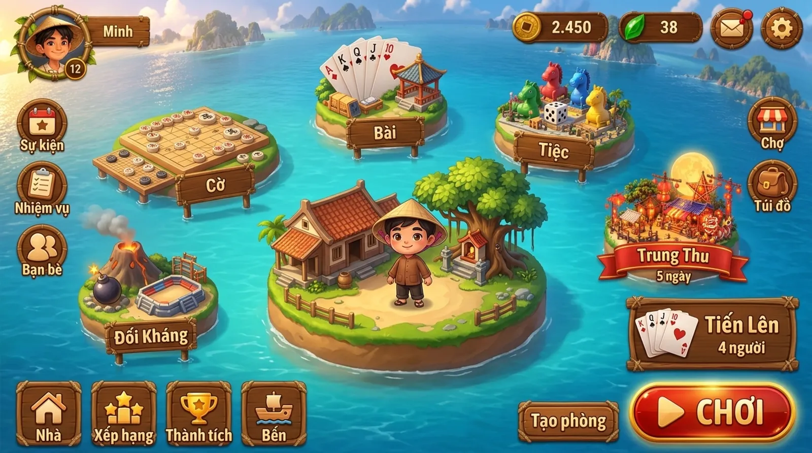
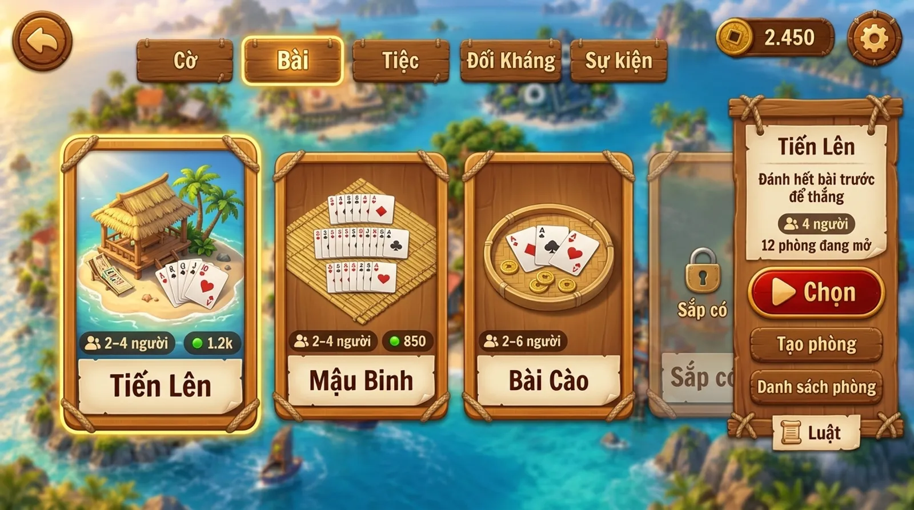

# Xóm Đảo: khung trải nghiệm

> Trạng thái: Phase 0, bản nháp chờ duyệt. Đây là cái khung chung mà hub và **mọi** trò, sự kiện
> sau này phải khớp: thế giới được tổ chức thế nào, HUD nằm đâu, người chơi vào một trò ra sao,
> phần thưởng hiện thế nào, và mọi thứ trông ra sao. Nó không mô tả luật của trò nào.
>
> Ảnh concept trong tài liệu này cho thấy **hướng đi**, không phải bản vẽ chính xác tới từng điểm
> ảnh. Chữ, số và bố cục cụ thể do các bảng và quy tắc bên dưới quyết định. Prompt tạo ảnh:
> [concepts/prompts.json](concepts/prompts.json).
>
> Tầm nhìn: [vision.md](vision.md). Kế hoạch: [roadmap.md](roadmap.md). Giao diện game thật đã
> tham khảo: [ui-references.md](ui-references.md). Khi ảnh concept và tài liệu đó khác nhau, theo
> tài liệu đó: ảnh AI đẹp nhưng không thực tế.
>
> **Hướng nghệ thuật là hoạt hình phẳng**, như ảnh sảnh, chọn trò, Nhà, sự kiện và bộ thành phần.
> Ảnh ván đấu, kết quả, danh sách phòng và ảnh hub cũ quá chi tiết, nhiều texture: chỉ xem bố cục,
> không xem phong cách; sẽ vẽ lại.

## Nguyên tắc

1. **Học bố cục từ game mobile nổi tiếng, vẽ lại bằng văn hoá Việt.** Sảnh chờ, chọn chế độ, chọn
   bản đồ, nút "Chơi" to ở góc dưới phải: người chơi game mobile (MOBA, bắn súng sinh tồn) đã quen
   tay. Nhưng mọi thứ là gỗ, tre, dây thừng, sơn mài, giấy dó, nón lá, đèn lồng.
2. **HUD mỏng, hình to, một nút lộng lẫy.** Như game thật: icon và hàng nút nhỏ, phẳng, nền trong
   mờ; cảnh và nhân vật chiếm phần lớn màn hình; chỉ nút CHƠI và vài bảng lớn được làm bằng gỗ, sơn
   mài, dây thừng.
3. **Trong ván, màn hình là của trò.** Phần khung (shell) chỉ giữ một nút menu nhỏ ở góc trên trái.
4. **Một lần chạm để vào chơi.** Nút **CHƠI** ở sảnh luôn mang trò đang chọn (mặc định là trò vừa
   chơi). Đổi trò là việc riêng, không chặn đường vào chơi.
5. **Một ngôn ngữ hình ảnh.** Mọi trò, mọi sự kiện dùng chung vật liệu, bảng màu, font, nút và âm
   thanh giao diện. Mỗi trò có "chất" riêng trong thẻ trò và bàn chơi của nó, không phải trong HUD.
6. **Mọi chuyển cảnh đều có chuyển động.** Không màn trắng, không vòng xoay tải giữa màn hình.

## Sảnh: Xóm và các đảo thể loại



> Ảnh concept vẽ năm đảo ngang nhau quanh Xóm. Bố cục thật theo mô tả dưới đây: Cờ và Bài là hai
> đảo lớn, các thể loại khác nhỏ hơn.

Thế giới có ba tầng, giống "chế độ chơi" và "bản đồ" của game mobile:

| Tầng | Giống trong game mobile | Ở Xóm Đảo |
| --- | --- | --- |
| **Sảnh** | Sảnh chờ có nhân vật ở giữa | Đảo **Xóm**, nhân vật của bạn đứng giữa |
| **Thể loại** | Chế độ chơi (Cổ điển, Giải trí…) | Một **đảo thể loại** quanh Xóm: hai đảo lớn Cờ, Bài; các thể loại khác là đảo nhỏ |
| **Trò** | Bản đồ trong một chế độ | Một **thẻ trò** trong danh sách kéo ngang của thể loại |

**Cờ** và **Bài** là hai thể loại chính của dự án. Mỗi cái có chỗ riêng, cố định trên sảnh: hai đảo
lớn nhất, hai bên Xóm. Các thể loại khác được **gom lại** và đặt vào khoảng trống còn lại (mặt biển
phía sau Xóm, giữa HUD trên và Xóm), mỗi thể loại một đảo nhỏ.

| Đảo | Chỗ | Trò |
| --- | --- | --- |
| **Cờ** | Đảo lớn, bên trái Xóm | Cờ Tướng, Cờ Vua, Cờ Vây, Cờ Đam, Caro, Cờ Cá Ngựa, Cờ tỷ phú, Bắn Tàu |
| **Bài** | Đảo lớn, bên phải Xóm | Tiến Lên, Mậu Binh, Bài Cào |
| **Sắp có** | Đảo nhỏ, khoảng trống phía sau | Đảo sương mù có ổ khoá, chưa có trò |

Bom Nguyên Tố không hợp với Cờ hay Bài. Nó chờ một thể loại phụ đầu tiên, và tới lúc đó vẫn chơi
trên client Phaser.

Khoảng trống phía sau có một số ô đảo nhỏ vẽ sẵn. Các thể loại phụ lấp ô theo thứ tự; nếu nhiều thể
loại hơn số ô, ô cuối thành một đảo **gom** mở màn chọn trò ở thể loại phụ đầu tiên chưa có ô. Chạm
Sắp có chỉ hiện thông báo nhanh "Sắp có".

Quy tắc dữ liệu:

- Danh sách thể loại là dữ liệu của phần lõi (id, tên, ảnh đảo, thứ tự, và **chính** hay **phụ**).
  Hai thể loại chính có chỗ cố định; thể loại phụ tự lấp ô trống. Thêm một thể loại phụ là thêm
  một dòng và một ảnh đảo; không sửa code sảnh.
- Mỗi trò khai báo nó thuộc thể loại nào. Thêm một trò là thêm một thẻ; không ai vẽ lại sảnh.
- Thể loại chưa có trò nào `ready` cũng hiện là đảo sương mù có ổ khoá. Khi chưa có thể loại phụ
  nào, ô đầu tiên là đảo Sắp có.

Bố cục HUD ở sảnh:

| Vùng | Chứa |
| --- | --- |
| Trên trái | Ảnh đại diện, tên, cấp → **Nhà** |
| Trên phải | Một hàng icon nhỏ: xu, ngọc, hộp thư, ⚙ |
| Cột trái | Sự kiện, Nhiệm vụ, Bạn bè (icon tròn nhỏ, có chấm đỏ) |
| Cột phải | **Banner có tranh**: sự kiện đang mở, Chợ, Túi đồ; nhãn nhỏ "Mới", "Miễn phí" |
| Dưới trái | Dòng chat mỏng; dưới nó là hàng nút chữ + icon: Nhà, Xếp hạng, Thành tích, Bến |
| Dưới phải | Thẻ trò đang chọn (đổi được) + nút **CHƠI** thật to + **Tạo phòng** |
| Giữa | Xóm, nhân vật của bạn, các đảo thể loại |

Các màn khác ngoài sảnh và ván đấu (chọn trò, Nhà, Chợ, Bến, kết quả) chỉ có ← ở trên trái và hàng
icon tiền + ⚙ ở trên phải.

Các nơi chốn của Xóm vẫn giữ tên làng: **Nhà** (hồ sơ, túi đồ), **Chợ** (cửa hàng), **Đình**
(tin tức, xếp hạng chung), **Bến** (phòng đang mở, bạn bè online, lời mời). Chúng là nút trên HUD,
và cũng là công trình bấm được trên đảo Xóm.

## Đường đi của người chơi

```
Mở game ─► Sảnh (Xóm)
  │
  ├─ CHƠI ──────────────────────────► Ghép phòng ─► Ván đấu ─► Kết quả ─┬─► Chơi tiếp
  │   (trò đang chọn)                                                     └─► về Sảnh
  │
  ├─ chạm đảo thể loại / thẻ trò đang chọn
  │      ▼
  │   Chọn trò: tab thể loại + danh sách thẻ kéo ngang
  │      ├─ Chọn ──────► về Sảnh, thẻ dưới phải đổi thành trò mới
  │      ├─ Tạo phòng ─► tuỳ chỉnh phòng ─► phòng chờ (có mã phòng) ─► Ván đấu
  │      └─ Danh sách phòng ─► vào phòng
  │
  ├─ Bến ─► Nhập mã phòng / bạn bè đang online / lời mời
  │
  ├─ Tạo phòng (ở Sảnh) ─► tuỳ chỉnh phòng của trò đang chọn
  └─ Nhà / Chợ / Bến / Sự kiện …  ─► màn nơi chốn ─► ← về Sảnh
```

- **CHƠI** = ghép nhanh: vào phòng còn chỗ của trò đang chọn, không có thì mở phòng mới, chờ một
  lúc rồi cho máy ngồi ghế trống.
- Nút ← luôn về đúng một bước. Từ ván đấu về sảnh có hỏi xác nhận nếu đang giữa ván.
- Chơi với bạn bè: phòng nào cũng có **mã phòng** ngắn. Gửi mã hoặc link mời; bạn bè nhập mã ở Bến
  hoặc mở link là vào thẳng phòng. Thoát ra thì về sảnh, với trò đó đang được chọn.

## Khung hình

Giữ hệ khung của [ui-guide.md](ui-guide.md#khung-hình): thiết kế trên khung **cao 720 đơn vị**, lõi
**960 × 720** luôn thấy được, màn rộng hơn chỉ thêm chỗ hai bên. Chỉ chơi màn hình ngang.

Trong Godot: kích thước gốc 960 × 720, `stretch/mode = canvas_items`, `stretch/aspect = expand`.
Bầu trời / mặt biển lấp phần thừa, vẽ tràn dưới tai thỏ; HUD tránh vùng an toàn (safe area).

Cỡ tối thiểu (vùng chạm 88, chữ nhỏ nhất 24…) theo bảng
[Đơn vị và cỡ tối thiểu](ui-guide.md#đơn-vị-và-cỡ-tối-thiểu).

## HUD trong ván


> Ảnh concept này chỉ để xem không khí. Bố cục theo các quy tắc dưới đây, rút từ Ludo King và
> Stumble Guys ([ui-references.md](ui-references.md#trong-trận)). Người chơi trên máy luôn ở
> **dưới**; ảnh lại vẽ Minh ở trên.

**Phần khung chỉ giữ một thứ: nút menu ☰** ở góc trên trái (88 × 88, sát mép). Menu mở một bảng
chung: rời phòng, âm thanh, cài đặt (cỡ giao diện, lề, chất lượng hình), luật chơi, biểu cảm. Trò
để trống ô vuông đó, còn lại cả màn hình là của trò.

Trò chọn một trong hai bố cục mẫu, để các trò cùng loại trông giống nhau:

| Bố cục | Giữa | Góc và hai bên | Dưới |
| --- | --- | --- | --- |
| **Bàn** (cờ, bài) | Bàn chơi vuông, cao gần trọn khung | Ô người chơi của đối thủ ở các góc hoặc hai bên, sát chỗ ngồi của họ (như Ludo King) | Người chơi trên máy: bài trên tay hoặc ô của mình; nút hành động (Đánh, Bỏ lượt) ở dưới phải |
| **Hành động** (trò hành động như Bom Nguyên Tố, sự kiện) | Cảnh chơi | Mục tiêu trên trái (dưới nút ☰), bộ đếm/thời gian trên phải | Cần điều khiển dưới trái, nút hành động dưới phải |

- Ô người chơi dùng thành phần chung: ảnh đại diện, tên, cấp, vòng thời gian vàng cho người đang
  tới lượt, 👑 cho chủ phòng. Thông tin riêng của trò (số lá bài, xúc xắc) nằm trong ô đó.
- Trong ván không hiện tên trò, tên phòng hay số dư xu.
- Biểu cảm: chạm vào ô của mình, hoặc mở từ menu.

## Chọn trò



- Trên cùng là **tab thể loại** hình biển đảo nhỏ, để đổi thể loại mà không quay ra sảnh: Cờ, Bài,
  rồi các thể loại phụ.
- Giữa là **danh sách thẻ dọc kéo ngang**. Mỗi thẻ: tranh minh hoạ, tên, số người, thời lượng một
  ván ("5–10 phút"), số người đang chơi, nút **?** mở bảng giới thiệu ngắn có hình. Thẻ đang chọn
  to hơn, viền vàng. Trò sắp có là thẻ mờ có ổ khoá ở cuối danh sách.
- Bên phải là **bảng chi tiết** của thẻ đang chọn, cùng một bố cục cho mọi trò:
  - tên, một câu giới thiệu, số người, số phòng đang mở;
  - **Chọn** (đặt làm trò của nút CHƠI);
  - **Tạo phòng** (mở màn tuỳ chỉnh của trò nếu có);
  - **Danh sách phòng**;
  - **Luật** (mở `RULES.md` của trò dưới dạng cuộn giấy).
- Gói `.pck` của trò được tải ngầm ngay khi thẻ được chọn, để lúc bấm CHƠI là vào luôn.

Màn tuỳ chỉnh khi tạo phòng (số người, luật phụ, bot) là một bảng gỗ do trò điền nội dung, dùng ô
lựa chọn và nút chung.

Danh sách phòng (từ bảng chi tiết hoặc từ **Bến**) là một bảng gỗ, mỗi dòng: tên phòng, trò, số
ghế, nút "Vào". Ảnh cũ dưới đây cho thấy cách trình bày dòng phòng:


## Kết thúc ván và phần thưởng


- Phần khung vẽ bảng kết quả. Trò chỉ trả về **thứ hạng** và tuỳ chọn một dòng tóm tắt
  ("Tới trắng!", "Thắng 3 cây"). Trò nào cần màn kết quả riêng (bảng điểm chi tiết) thì khai báo,
  và vẫn phải kết thúc bằng phần phần thưởng chung.
- Phần thưởng do server tính (sổ cái). Xu và tài nguyên **bay** từ bảng vào góc trên phải, số dư
  đếm lên. Có âm thanh xu rơi.
- Hai nút: **Chơi tiếp** (ván mới, cùng phòng) và **Về sảnh**. Ảnh concept còn ghi "Về đảo".

## Nhà: hồ sơ, túi đồ, thành tích, xếp hạng


- Mở từ ảnh đại diện ở góc trên trái, nút Nhà ở hàng dưới trái, hoặc chạm ngôi nhà trên Xóm.
- Thẻ hồ sơ bên trái: ảnh đại diện, tên, cấp và thanh tiến độ, vài con số tổng.
- Bên phải là kệ gỗ, chia theo **thẻ đánh dấu** (bookmark) gỗ: Túi đồ, Thành tích, Xếp hạng.
- Túi đồ là các ô trên kệ. Vật phẩm nào cũng có biểu tượng vuông, nền trong suốt, để đặt được vào ô.
- Hồ sơ của người khác (chạm vào ô người chơi) dùng cùng thẻ, chỉ đọc.

## Sự kiện


- Bản đầu chưa có sự kiện. Khi khung sự kiện ra đời, **Sự kiện** là một thể loại phụ: một đảo nhỏ ở
  khoảng trống phía sau Xóm.
- Khi có sự kiện đang mở, đảo Sự kiện sáng lên ở sảnh, có cờ hiệu và số ngày còn lại; nút Sự kiện ở
  cột trái có chấm đỏ. Mỗi sự kiện là một thẻ trong thể loại Sự kiện.
- Bảng chi tiết của sự kiện có cùng bố cục với bảng chi tiết trò, nhưng **được đổi màu** (ví dụ
  sơn mài đỏ viền vàng cho Trung Thu) và có thêm **dải phần thưởng** theo mốc.
- Nút chính là **Tham gia**. Bên trong, sự kiện là một trò bình thường và theo mọi quy tắc HUD ở
  trên.
- Khi sự kiện đóng, thẻ của nó biến mất; vật phẩm đã nhận vẫn ở trong túi đồ. Không còn sự kiện nào
  thì đảo Sự kiện chìm vào sương.

## Ngôn ngữ hình ảnh


> Chữ tiếng Anh trên bảng này do công cụ tạo ảnh viết sai; chỉ xem hình dạng và màu.

Ảnh mẫu phong cách là [ảnh sảnh](concepts/lobby.webp): hoạt hình phẳng, mảng màu sạch, viền mềm,
bóng đơn giản, ít texture. Không vẽ vân gỗ, rêu, hạt nước hay ánh sáng điện ảnh chi tiết.

**Thế giới:** xóm chài Việt Nam kiểu đồ chơi: tre, dây thừng, thúng, thuyền thúng, mái ngói đỏ,
đèn lồng. Hoạt hình phẳng 2.5D, khối mềm, bóng ngắn, nắng từ trên trái. Đảo thể loại là diorama
nhỏ; không đảo nào lấn át Xóm và nhân vật ở giữa.

**Vật liệu giao diện:**

| Thành phần | Vật liệu |
| --- | --- |
| Nút CHƠI và nút chính trong bảng | Sơn mài đỏ viền vàng, chữ kem: thứ lộng lẫy duy nhất |
| Bảng lớn (kết quả, chi tiết trò, sự kiện) | Gỗ mật ong, buộc dây thừng, ruột giấy dó màu kem |
| Nút phụ | Phẳng, màu gỗ, chữ nâu đậm hoặc kem |
| Icon, hàng nút nhỏ, thanh tiền | Hình phẳng đơn giản, nền nâu trong mờ, chữ kem; không vân gỗ, không dây thừng |
| Ảnh đại diện | Vòng tre; khung khác là vật phẩm trang trí |
| Tiền | Đồng **xu** đồng có lỗ vuông; tài nguyên phụ là **ngọc** xanh lá |
| Thẻ trò | Khung gỗ dọc bo góc, tranh minh hoạ trên, bảng tên giấy dưới |
| Chấm thông báo | Chấm đỏ đèn lồng ở góc trên phải của nút |
| Thông báo nhanh | Mẩu giấy dó trượt xuống từ trên giữa |

**Bảng màu** (giá trị sẽ chốt trong `docs/art-direction.md`):

| Vai trò | Màu |
| --- | --- |
| Biển | Ngọc lam trong |
| Cát, giấy | Kem ấm |
| Gỗ | Mật ong |
| Cây | Xanh tre |
| Mái, nhấn | Đỏ ngói, đỏ đèn lồng |
| Quý, thưởng | Vàng đồng |
| Chữ | Nâu đậm trên giấy, kem trên gỗ |

**Chữ:** một font tròn đậm cho tiêu đề và số, một font sans dễ đọc cho chữ nhỏ. Cả hai phải có đủ
dấu tiếng Việt.

**Chuyển động:** nút nhún khi chạm; bảng gỗ đung đưa nhẹ khi hiện; camera bay khi đổi màn; xu bay
khi nhận thưởng. Không có chuyển động nào chặn người chơi quá 0,6 giây.

**Âm thanh giao diện:** tiếng gỗ khi chạm, tiếng giấy khi mở bảng, tiếng xu khi nhận thưởng, sóng
biển nền ở sảnh. Mỗi trò có nhạc nền riêng; âm thanh giao diện là của chung.

## Khế ước cho mọi trò và sự kiện

Một trò hay sự kiện **phải**:

- [ ] Khai báo: tên, thể loại, một câu giới thiệu, số người, thời lượng một ván, phần thưởng tối
      đa; sự kiện thêm ngày mở/đóng và dải phần thưởng.
- [ ] Có tranh thẻ trò (dọc, theo khung chung) và tranh nhỏ cho thẻ "trò đang chọn" ở sảnh.
- [ ] Dùng thành phần chung từ `xomdao_sdk`: nút, bảng, ô người chơi, ô lựa chọn, thông báo.
- [ ] Theo một bố cục mẫu trong ván (**Bàn** hoặc **Hành động**); để trống ô của nút ☰.
- [ ] Trả thứ hạng khi hết ván và để phần khung hiện kết quả, phần thưởng.
- [ ] Vừa lõi 960 × 720 ở mọi tỉ lệ khung; vùng chạm ≥ 88, chữ ≥ 24.
- [ ] Có ảnh chụp ở các khung (`npm run shots`) và kịch bản e2e.

Một trò hay sự kiện **không được**:

- Vẽ nút quay lại, menu, cài đặt, âm thanh, số dư hay tên trò của riêng nó.
- Tự cộng tiền hay vật phẩm cho người chơi.
- Dùng font, bảng màu giao diện hay kiểu nút khác (thế giới bên trong trò thì tự do).
- Hiện chữ hướng dẫn kiểu "chạm vào đây để…".

## Còn để ngỏ

- Avatar: bố cục sảnh kiểu game mobile đặt **nhân vật** của bạn ở giữa, và ảnh ván đấu cho đối thủ
  ngồi quanh bàn như nhân vật thật. Đây là hướng đề xuất. Cái giá: mỗi trang phục, mỗi tư thế phải
  làm bằng Blender. Nếu chỉ dùng ảnh tròn, giữa sảnh sẽ là ngôi nhà của bạn trên Xóm.
- Cấp người chơi tính từ đâu (tổng ván, kinh nghiệm riêng)?
- Ngọc (tài nguyên thứ hai) dùng vào việc gì.
- Có chat chữ hay chỉ biểu cảm.
