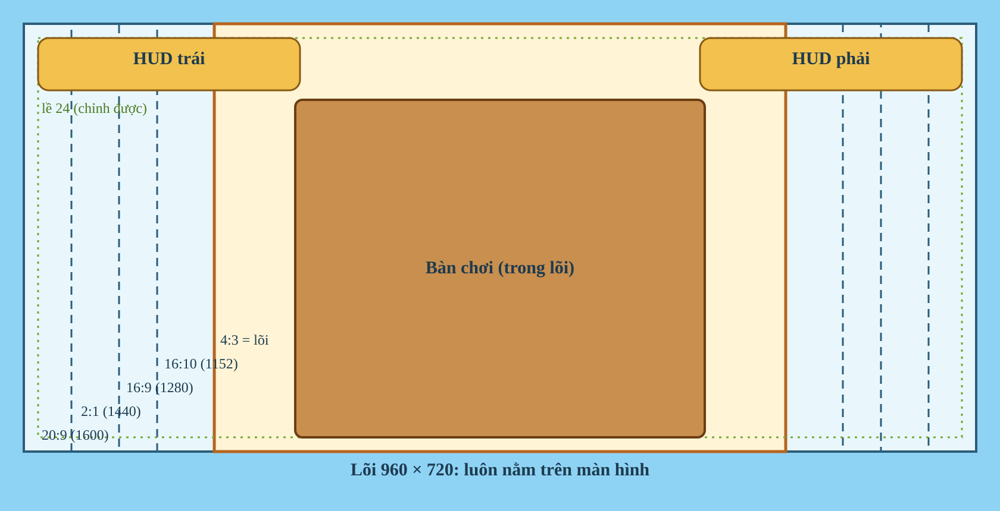

# Giao diện: khung ngang, HUD và bàn chơi

Ứng dụng là một game mobile chơi **xoay ngang**, cài như PWA. Tài liệu này là định hướng chung cho
mọi màn hình: khung hình, đơn vị, chỗ đặt HUD, cỡ chữ và nút, cách dựng bàn chơi và kích thước
hình. Game mới và mọi thay đổi giao diện bám theo đây.

Ứng dụng đang được chuyển dần sang hướng này qua từng PR: bàn chơi của từng game sẽ theo sau.

## Khung hình

Mọi thứ được thiết kế trên một **khung cao 720 đơn vị**. Chiều rộng chọn một trong năm tỉ lệ:

| Tỉ lệ | Khung | Máy thường gặp |
| --- | --- | --- |
| 4:3 | 960 × 720 | iPad, máy tính bảng |
| 16:10 | 1152 × 720 | laptop, máy tính bảng Android |
| 16:9 | 1280 × 720 | laptop, màn hình máy tính, iPhone (trừ tai thỏ) |
| 2:1 | 1440 × 720 | điện thoại 18:9 |
| 20:9 | 1600 × 720 | phần lớn điện thoại Android bây giờ |



- Ứng dụng chọn khung rộng nhất mà màn hình (trừ tai thỏ, thanh home) chứa được, rồi phóng nó cho
  vừa. Phần thừa hai bên (hoặc trên dưới) là **bầu trời**, vẽ tràn cả dưới tai thỏ; không có viền
  đen.
- **Lõi 960 × 720** ở giữa luôn nằm trên màn hình, ở mọi khung. Thứ bắt buộc phải thấy (bàn cờ,
  bài trên tay, nút đánh) đặt trong lõi. Khung rộng hơn chỉ thêm chỗ ở hai bên: danh sách người
  chơi, nút phụ, trang trí.
- Không co giãn tự do nữa: mỗi khung có một cách xếp cố định, nên hình luôn đúng tỉ lệ và thử được
  hết (5 khung).
- Canvas vẽ đúng mật độ điểm ảnh của máy (tới 3×), nên 1 đơn vị trên điện thoại là khoảng 1,5
  điểm ảnh thật, trên iPad khoảng 2,3.
- Cầm dọc: điện thoại hiện màn "Xoay ngang máy". Máy tính có cửa sổ hẹp thì khung 4:3 nằm giữa,
  trời ở trên dưới.

## Đơn vị và cỡ tối thiểu

Điện thoại cầm ngang cao khoảng 360 điểm CSS, nên **1 đơn vị ≈ 0,5 điểm CSS** trên điện thoại. Cỡ
tối thiểu tính cho máy nhỏ nhất đó:

| Thứ | Cỡ (đơn vị) | Trên điện thoại |
| --- | --- | --- |
| Vùng chạm nhỏ nhất | 88 × 88 | 44 điểm, cỡ ngón tay |
| Chữ nhỏ nhất (phụ, số điểm) | 24 | 12 điểm |
| Chữ thường, chữ trên nút | 32–36 | 16–18 điểm |
| Tiêu đề, thông báo lớn | 48–72 | 24–36 điểm |

Khoảng cách dùng thang 8 · 16 · 24 · 32 · 48 · 64.

Trong code, `hudScale()` (hay `ctx.screen.hud`) là **tỉ lệ HUD**, mặc định khoảng 1,35 trong đơn vị
khung, nhân với cỡ HUD người chơi chọn. Cỡ chữ và nút nhân với nó; kích thước bàn chơi thì không.

## HUD

- **Góc trên trái**: nút quay lại (←, chỉ biểu tượng) và 🏠, hoặc hồ sơ ở trang chủ. **Góc trên
  phải**: âm thanh, cài đặt. Hai góc cao 88, cách mép một **lề** (mặc định 24).
- Không ghi tên game hay tên phòng trong ván: người chơi biết mình đang ở đâu, chỗ đó dành cho bàn.
  Chủ phòng có 👑 trong danh sách người chơi; game tự vẽ người chơi thì tự thể hiện chủ phòng.
- Giữa hai góc để trống cho bàn chơi: HUD không phủ ngang cả màn hình. `ctx.screen.gap` cho biết
  khoảng trống giữa hai góc; bàn vuông lọt vừa khoảng đó thì được cao gần trọn khung, lên tận mép
  trên.
- Người chơi chỉnh được **cỡ giao diện** (80–130%, chữ và nút) và **lề màn hình** (0–32 điểm CSS:
  cả khung lùi vào khỏi mép, trời lấp chỗ trống) trong bảng cài đặt (nút bánh răng), lưu theo từng máy
  (`apps/web/src/lib/frame.ts`).
- Cùng bảng đó có **chất lượng hình**: Cao (mặc định, tới 3× điểm ảnh), Vừa (2×), Thấp (1×). Máy
  yếu bị giật thì hạ xuống: ít điểm ảnh phải vẽ hơn, hình mềm hơn một chút.
- HUD của React (bảng, hộp thoại, thanh phòng) và nút vẽ trong Phaser dùng chung tỉ lệ này, nên
  luôn khớp nhau.

## Thành phần

| Thành phần | Cỡ (đơn vị, ở cỡ HUD 100%) | Ghi chú |
| --- | --- | --- |
| Nút chính (Đánh, Xong, Tạo phòng) | cao 96, chữ 36 | vàng, nền 9-slice |
| Nút phụ (Bỏ lượt, Luật) | cao 80, chữ 30 | xanh hoặc vàng nhạt |
| Nút biểu tượng (âm thanh, cài đặt) | 88 × 88 | |
| Ô lựa chọn (màn tuỳ chỉnh) | cao 80, rộng ít nhất 160 | |
| Ô người chơi | ảnh đại diện 96 (gọn: 72), tên 30, phụ 24 | |
| Bảng, hộp thoại | lề trong 32, bo góc 24 | gỗ và giấy |

- Nền nút và bảng là **9-slice**: góc giữ nguyên hình, chỉ phần giữa giãn. Không bao giờ kéo dãn
  nguyên tấm ảnh (`this.button(..., { image, slice })` đã làm sẵn).
- Mỗi nút có trạng thái thường, sáng lên khi rê chuột, lún khi bấm, mờ khi tắt.

## Bàn chơi

Người chơi phải thấy mình đang ngồi trước bàn: **bàn chiếm gần hết chiều cao**, không có viền dày
hay khung trang trí ăn chỗ.

- **Cờ (Caro, Cờ tướng)**: bàn cờ cao từ ngay dưới hàng HUD tới mép dưới (khoảng 580–690 đơn vị),
  nằm giữa lõi. Bên trái: hai người chơi, đồng hồ, điểm. Bên phải: nút (Xin hoà, Đầu hàng…) và
  dòng trạng thái. Viền bàn cờ mỏng (không quá 4% cạnh bàn).
- **Bài (Tiến Lên, Mậu Binh)**: mặt bàn (nỉ, hay chiếu cói như Tiến Lên) phủ kín cả màn hình;
  mép bàn nếu có chỉ là một đường viền mỏng. Bài trên tay nằm ở dải dưới (lá cao khoảng 150–180), đối thủ ở mép trên và hai bên, chồng
  bài đánh ra ở giữa. Nút đánh ở góc dưới phải, ngay trên hoặc cạnh bài trên tay.
- Hiệu ứng (bài bay, quân đi, chữ "Chặt heo!") nằm trong khung, không đè lên HUD.

## Hình và kích thước

- Hình phải đủ điểm ảnh cho lúc phóng to nhất: **cỡ ảnh ≥ cỡ hiển thị (đơn vị) × 2,3**. Ví dụ một lá
  bài cao 160 cần ảnh cao ít nhất 368; một quân cờ 68 cần ảnh 160.
- Ảnh to hơn nhiều so với cần thì thu nhỏ lại khi xuất, cho nhẹ và mượt.
- `npm run shots -- --path '<trang>' --audit` đo thật trên màn hình: mỗi ảnh đang hiện bị phóng
  to bao nhiêu lần so với điểm ảnh của nó, và cần xuất ra cỡ nào. Thử trên `ipad` (phóng to
  nhất). Đặt kích thước hình theo đơn vị thiết kế (không theo điểm ảnh của ảnh), để xuất ảnh to
  hơn không làm hình to ra.
- Nền nút, nền bảng cần ghi độ dày viền (để đặt `slice`) khi làm hình.

## Chuyển động

- Mục tiêu 60 khung hình mỗi giây trên điện thoại tầm trung.
- Hiệu ứng dùng tween đổi vị trí, tỉ lệ, độ trong suốt. Tránh đổi chữ hay cỡ chữ trong lúc chạy
  hiệu ứng: chữ phải vẽ lại mỗi lần đổi.
- Đo trên máy thật: cắm điện thoại, mở `chrome://inspect` trên máy tính, dùng tab Performance.

## Kiểm tra

- `npm run shots -- --path '/?play=<id>'` chụp một màn trên nhiều máy thật (xoay ngang, đúng mật độ
  điểm ảnh). Dòng in ra so mật độ canvas với màn hình; soi độ nét ở các file `-crop.png`.
- Thử cả khung hẹp nhất (iPad, 4:3) và rộng nhất (điện thoại 20:9).
## Lưu Graphics tĩnh thành texture

`rasterizeGraphics` từ `@psc/sdk/client` lưu khung, nền hoặc nút vẽ bằng Phaser
Graphics thành ảnh, tránh dựng lại đường bo mỗi khung hình. `bounds` dùng tọa độ
cục bộ và cần chứa cả viền lẫn bóng. Ảnh giữ vị trí, scale, depth và container cha;
Graphics gốc được ẩn. Texture có mật độ tối đa 3×, giới hạn cạnh 4096 px và được
dọn khi scene đóng. Chỉ gọi lại khi hình thay đổi, dùng cùng key và ảnh cũ để cập nhật.

```ts
import { rasterizeGraphics } from '@psc/sdk/client';

const shape = this.add.graphics()
  .fillStyle(0xfff6e7)
  .fillRoundedRect(-100, -40, 200, 80, 16);
const paper = rasterizeGraphics(this, shape, 'stats-panel', {
  x: -103, y: -43, width: 206, height: 90,
});
// Khi bố cục hoặc nội dung Graphics đổi:
rasterizeGraphics(this, shape, 'stats-panel', {
  x: -103, y: -43, width: 206, height: 90,
}, paper);
```


