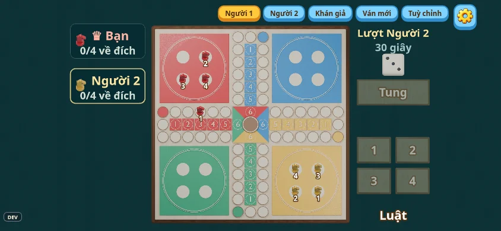
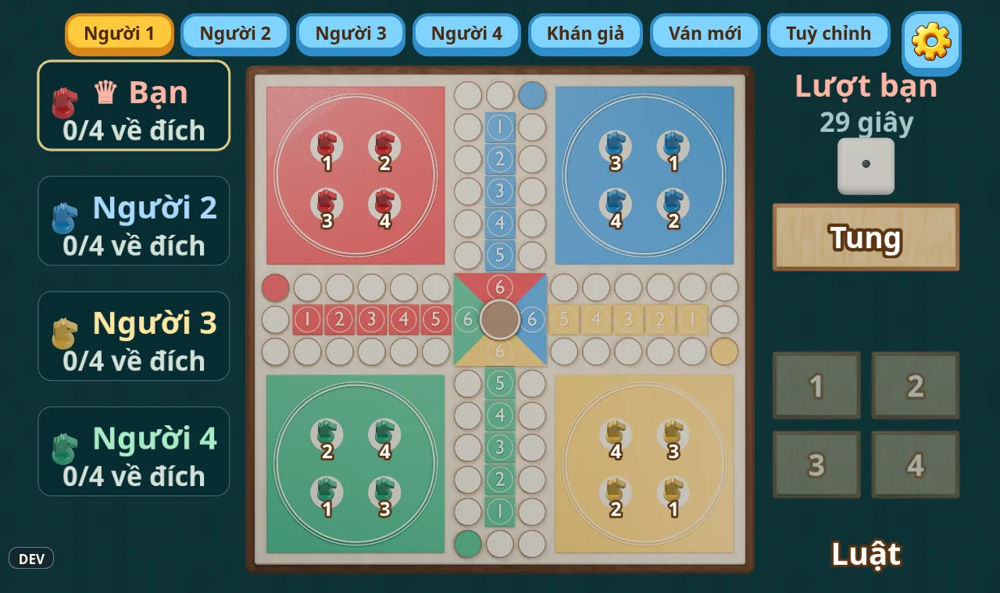

# Cờ Cá Ngựa

Cờ cá ngựa một xúc xắc cho 2–4 người, có thể chơi với 1–3 máy. Xem [luật chơi](RULES.md). Plugin có trạng thái `ready`.

## Giao diện

Điện thoại nằm ngang:



Máy tính, bốn người:



## Mã nguồn

- `src/game/model.ts`: dữ liệu ngựa, nước đi, chặn đường, đá ngựa và chuồng 6–5–4–3.
- `src/game/CoCaNguaGame.ts`: server kiểm tra lượt, tung xúc xắc bằng `ctx.rng`, timer, người máy và thứ hạng.
- `src/scenes/CoCaNguaView.ts`: bàn chơi, lựa chọn ngựa, luật phân trang với hình minh họa 2D, âm thanh và pháo hoa ăn mừng qua `SceneRuntime`.
- `src/scenes/victoryBadge.ts`: huy hiệu cúp vàng và vòng nguyệt quế, ruy băng theo màu người chơi và thứ hạng khi ăn mừng.
- `src/scenes/board.ts`: ánh xạ đường đi sang đúng tọa độ của bàn Blender.
- `src/scenes/Setup.ts`: chọn bạn bè hoặc số người máy, chế độ Thường hoặc Phân hạng.
- `src/scenes/CoCaNguaBackground.ts`: nền nỉ xanh phủ kín khung.
- `sources/render_assets.py`: dựng bàn gỗ, atlas ngựa và normals, sáu mặt xúc xắc, nút và nền nỉ bằng [Blender helper chung](../../tools/blender/xomdao_bake/__init__.py).

## Chạy và kiểm tra

```sh
npm run dev
npm run blender -- co-ca-ngua
npm run check
npm run e2e -- --changed origin/main
npm run shots -- --path '/?play=co-ca-ngua&players=4'
```

Chơi thử tại `http://localhost:5033/?play=co-ca-ngua&players=4`. Chạm hình xúc xắc lớn có dòng chữ nhấp nháy `Chạm để tung` để tung. Các nút số 1–4 chọn ngựa tương ứng; trên bàn cũng chọn được ngựa có vòng sáng. Nút `Luật` mở từng trang luật căn trái, có hình minh họa và nút chuyển trang lớn ở hai bên. Chế độ Phân hạng tiếp tục sau khi có người hoàn thành, hiển thị thứ hạng bên cạnh tên người chơi; mỗi người hoàn thành được ăn mừng bằng ngựa nhảy múa trong pháo hoa, kèm huy hiệu cúp vàng ghi tên và thứ hạng.

Console phát triển trong phòng server hỗ trợ `set-horse <seat> <horse> <position>` và `roll-dice <value>` để thử nước đi. Ghế và ngựa đánh số từ 0; vị trí `-1` là chuồng, `0–51` là đường đua theo màu mình, `52–57` là ô chuồng 1–6. `roll-dice` chỉ hoạt động khi đang chờ tung. Đây là lệnh phát triển qua SDK, không phải sự kiện người chơi gửi được trên production.

## Hình và âm thanh

Hình bàn, ngựa, xúc xắc, nút và nỉ được tạo trong Blender bằng mã nguồn của dự án; không dùng tài nguyên bên ngoài. Ngựa dùng atlas diffuse/normals cùng kích thước, normals RGB opaque và lossless, ánh sáng chung phía trên trái. Bàn 1664 px đủ nét trên máy tính bảng.

Ảnh đảo giữ bộ hình hiện có trong `sources/prompts.json`. Nhạc và hiệu ứng Cờ Cá Ngựa giữ bộ âm thanh hiện có của dự án; các hiệu ứng ngắn được chỉnh tốc độ, âm lượng và fade để theo nhịp hoạt ảnh. Nguồn lưu trữ nằm trong `assets/games/co-ca-ngua/audio/`; xem [ghi công tài nguyên](../../LICENSE-ASSETS.md).

## Bản Godot

`godot/main.gd` dựng bàn trong client Godot: bàn vuông ở giữa, ô người chơi ở góc cạnh chuồng
màu của họ, xúc xắc nằm ở cột của người đang tới lượt. Chạm xúc xắc để tung; ngựa đi được có vòng
vàng, chạm ngựa để đi. Ngựa nhảy từng ô, ngựa bị đá trượt về chuồng, đội về đủ bốn ngựa nhảy múa.
`godot/rules.gd` đặt ngựa trên lưới 15 × 15 và tìm nước đi (chép từ `model.ts`, `board.ts`);
hình ở `godot/art/`, âm thanh ở `godot/sounds/`, nhạc ở `godot/music/`; test: `godot/test/`.

Chạy: `npm run godot:export -- --debug` rồi mở `http://localhost:5033/godot/?play=co-ca-ngua`
(ba máy, trên server thật).

